+++
title = "Cocktails"
date = 2025-11-13
draft = false
description = "The importance of alcohol consumption. A taxonomy of cocktails + recipes + bartending tips. My wine, spirit, and liqueur reviews."

[extra]
new = true
+++

Making cocktails at home is good because:

1. You can customize them to your or your guests' liking
2. You can make cocktails with high-end liquors that you pick out
3. You can enjoy drinking in your own quiet space
4. Bartending at home is cost effective

I am by no means an expert on this topic but here is what I've learned so far.

## Philosophy

The history of alcohol consumption predates humanity.
All creatures love alcohol.

<figure class="content">
  <iframe width="620" height="349" src="https://www.youtube.com/embed/2bbXICmvSUs" title="Drunk squirrel, because...2020." frameborder="0" allow="accelerometer; autoplay; clipboard-write; encrypted-media; gyroscope; picture-in-picture; web-share" referrerpolicy="strict-origin-when-cross-origin" allowfullscreen></iframe>
  <figcaption>
Observe. The joy of poison.
</figcaption>
</figure>

### Alcohol as Poison

The alcohol we consume is [*ethanol*](https://en.wikipedia.org/wiki/Ethanol).
When it enters the bloodstream, it is metabolized by the liver into [*acetaldehyde*](https://en.wikipedia.org/wiki/Acetaldehyde), which is toxic.
It is further metabolized into *acetate* which is easily handled and removed by the body.

The longer our body experiences elevated levels of acetaldehyde, the more we will suffer from acute alcohol toxicity.
There are two factors to consider:
⓵  Cmax ⓶

<!--
https://xcancel.com/RandomSprint/status/1991614207897559137#m
https://en.wikipedia.org/wiki/Area_under_the_curve_(pharmacokinetics)
https://en.wikipedia.org/wiki/History_of_alcoholic_beverages
-->

The liver can metabolize about 7-10g of ethanol per hour, while a standard drink contains around 14g of ethanol.
The lesson here is that binge drinking is very harmful as it spikes both Cmax and AUC to a much greater degree than even light drinking done frequently.

### Alcohol as Social Ill

Alcohol is controversial.
Prohibition had lots of political power and was passed almost unanimously.
The temperance movement, Henry D Cogswell (A very interesting man who also installed a statue of Benjamin Franklin which is today located in Washington Square in SF. Check it out!), temperance fountains. ["To temperance, I'll drink to that!"](https://en.wikipedia.org/wiki/Cogswell_Society)
Now once again, the anti-alcohol movement is in vogue.

- The Absinthe Drinker by Viktor Oliva (1861–1928)
- The Drunkard's Progress (1846) by Nathaniel Currier warns that moderate drinking may lead to suicide step by step. (https://en.wikipedia.org/wiki/Temperance_movement)
- https://en.wikipedia.org/wiki/The_Drunkard%27s_Progress
- https://www.google.com/url?sa=t&source=web&rct=j&url=https%3A%2F%2Fwww.thoughtco.com%2Ftemperance-movement-prohibition-timeline-3530548&ved=0CBUQjRxqFwoTCNjIy_WRw5EDFQAAAAAdAAAAABAH&opi=89978449
- https://www.google.com/url?sa=t&source=web&rct=j&url=https%3A%2F%2Fsocialwelfare.library.vcu.edu%2Freligious%2Fthe-temperance-movement%2F&ved=0CBUQjRxqFwoTCNjIy_WRw5EDFQAAAAAdAAAAABA9&opi=89978449 (LMAO there are so many good temperance propaganda posters)
- https://preview.redd.it/6hr7nqo6uky41.jpg?width=640&crop=smart&auto=webp&s=a20449bb55b5e56ac9a9cbee749ec0e3dfa337f9

- "Woman's Holy War. Grand Charge on the Enemy's Works". An allegorical 1874 political cartoon print, which shows temperance campaigners as virtuous armoured women warriors, wielding axes to destroy barrels of Beer, Whisky, Gin, Rum, Brandy, Wine and Liquors, under the banners of "In the name of God and humanity" and the "Temperance League". (https://en.wikipedia.org/wiki/Temperance_movement)
- La fin de la fée verte ("The End of the Green Fairy"): Swiss poster criticizing the country's prohibition of absinthe in 1910 (https://en.wikipedia.org/wiki/Absinthe)

### Alcohol as Social Boon

While people nowadays emphasize the negative health effects of alcohol, there are also many countervailing benefits.
Arguably, alcohol is, on net, a positive for the highest-order of humanity. (I have changed my position on this from before. I used to be strongly anti-alcohol.)
It's benefits are vast, social lubrication, truth seeking, beautiful flavors, relaxation and leisure. In vino veritas. Alcohol allows the mind to smoothen and enter a flow state, the Ballmer peak (this isn't a myth, try it yourself)

- Henri Privat-Livemont's 1896 poster (https://en.wikipedia.org/wiki/Absinthe)
- https://images.wisconsinhistory.org/700012070003/1207000055-l.jpg

### Alcohol as Medicine

Even if we think about health, light alcohol has no consequence wrt all-cause mortality, and it may even be cardioprotective due to its blood thinning effects, although it may increase risks for particular cancers.

- https://www.nytimes.com/2025/12/16/health/alcohol-heart-disease-cancer.html

### Alcohol According to the Greeks

In order to consume alcohol in a manner that maximizes its benefits while mitigating its downsides, one must turn to the Greeks (of course, no matter the question, one must always look towards the Greeks, this is common sense).

We find that as we worship Dionysus, we must also pay respect to [Sophrosyne](https://en.wikipedia.org/wiki/Sophrosyne).

In ancient greece, we find the Symposium: Not a drinking party, but similar to a French salon - a talking party, aided by poison.
The Symposium was led by a Symposiarch and the amphora wine was diluted in the krater and then served in the kylix.
The wine in the krater was often diluted in a ratio of 1:3 water:wine and since a kylix held 250-300ml of liquid, each drained kylix is about 0.6 "standard" drinks.
Now note:

<!--
Add stickers for Kylix, Krater, Amphora
Amphora (wine) + Water -> Krater -> Kylix
-->

> For sensible men I prepare only three kraters: one for health (which they drink first), the second for love and pleasure, and the third for sleep. After the third one is drained, wise men go home. The fourth krater is not mine any more – it belongs to bad behaviour; the fifth is for shouting; ... the tenth is for madness and unconsciousness.

3 kraters!
For a party of 30 perhaps.
And this was for Greek Symposia, designed for the alcohol-resistant Greek men.
This would amount to 10-ish kylixes per person, which means about 6 "standard" drinks, spread out over many hours and with high dilution.

Remember the original point of the symposium.
Discussion among intelligent men.
To enable this we must not dip too far into the hysteria of Dionysus.

Here are some rules a wise Greek might enforce today:

1. 2-3 cocktails per person, roughly one drink per hour with water to dilute alcohol in the stomach
1. Avoid mixing base spirits or alcohols! Choose to only serve wine / sake or if serving cocktails, keep the base spirit the same (gin, whiskey, Irish cream, etc.) for each individual. Do not mix!
1. Aim for midday drinking where the alcohol will be metabolized by the time one is asleep. Drinking small amounts throughout the week is far better than binge drinking.
1. Take electrolytes and DHM and other cures before drinking. Put my electrolyte recipe here
1. Don't go to sleep later than midnight, disrupting the sleep time and adding poison to the mix has a doubly devastating consequence

<!--
https://en.wikipedia.org/wiki/Krater
https://bmcr.brynmawr.edu/1991/1991.05.13/?utm_source=chatgpt.com (Sympotica: A Symposium on the Symposion)
https://en.wikipedia.org/wiki/Salon_(France)
https://en.wikipedia.org/wiki/Symposium
https://en.wikipedia.org/wiki/Temperance_(virtue)
https://chatgpt.com/c/6925080f-7940-8331-9741-c5e1190f61a4
https://chatgpt.com/c/6925ed6c-e968-8332-8a22-facd170e6e69
-->

## Taxonomies

- https://www.reddit.com/r/cocktails/comments/1hd0f9h/i_boiled_down_cocktail_codex_for_my_staff_and_im/
  - Should make an HTML version of this! Very nice illustration, albeit a bit wrong. This must have come from the model.

>  Copy pasting a comment I wrote on this subreddit almost a month ago. Seems we're on the same page:
> 
> Going through Cocktail Codex right now. Something that I realized kinda bothers me, why don't they call the Daiquiri category the Sour category with the Daiquiri as the first character introduced? I get that they like the idea of here's a drink and now we make adjustments, but they can still do that with calling the chapters/categories by something more descriptive like Sours.
> 
> Like the Sidecar chapter. Literally not once in the entire chapter do they ever call any of the drinks a daisy or even mention daisy at all. Wouldn't that be useful information to include? But in the Daiquiri chapter they make a reference to Sours vs Daisies and say that margaritas (in the Sidecar chapter) are firmly daisies. They say they'll talk about Sours vs Daisies more in the Sidecar chapter, but they don't, instead they talk about Daiquiris vs Sidecars in that chapter.
> 
> I almost suspect they initially were going to have a more general categorization (Sours, Daisies, etc), but when they got further into writing the book, they preferred to focus more and more on their 'root cocktail' taxonomy (daiquiri, sidecar, etc) which I think is a bit unfortunate. 

I agree. The "root recipes" ought to not be cocktails themselves, but categories (sour, daisy, ...).

According to [Cocktail Codex](https://www.deathandcompanymarket.com/products/cocktail-codex), there are 6 fundamental recipes that are at the root of every cocktail.

The Six Root Recipes
: - label: Old Fashioned (spirit + sugar + bitters)
  - label: Martini

There are a bunch of base spirits to use too. And many cocktails can be made with a split-base.
The bases that are used in the specs below are:

The Base Spirits
: - label: Whiskey (this is a very broad category encompassing Bourbon - smooth, Wheat whiskey - light and full-bodied, Rye Whiskey - spicy, Irish Whiskey, and Scottish Whiskey)
  - label: Rum (also many varieties, unaged white, aged white, aged, highly aged and dark and from various countries: Jamaica (funky), ... )

The attribute (function / occasion / style)
: - aperetif
  - digestifs
  - Winter oriented
  - Summer oriented
  - Tiki

With this out of the way, let's get onto the recipes.

## Methodologies

- https://punchdrink.com/articles/hack-your-drink-regal-shake-cocktail-recipe-technique/
  - The "Regal Shake": citrus (orange or lime) peel in shaker -> extraction of oils in the drink -> drying effect

## Specs

These aren't the "true" "official" recipes, but rather my own hacked together versions that I like.

<!--
A sticker with a white border, no backdrop or shadow, and a white background. High resolution. Sketchy, cartoon-like style.
Use this attached image as reference, but preserve the sketchy/cartoon style from the previous generations.

Whiskey: The sticker should be a bottle of whiskey modeled after the Four Roses Small Batch Bourbon bottle.
Simple syrup: The sticker should be a glass bottle of clear simple syrup with a label. Just use the words 'Simple Syrup' with perhaps a flourish. Use a glass bottle with a tight metal clasp and rubber gasket (a flip-top metal clasp).
Plus: The sticker should be a thick black solid plus (+) sign. Keep the sign no larger than 50% of the vertical and horizontal space you have to work with.
Angostura bitters: The sticker should be a bottle of Angostura bitters. Use the classic design. Reference how it looks via image search.
Orange bitters: The sticker should be a bottle of Angostura orange bitters. Use the classic design. Reference how it looks via image search.
Right arrow: The sticker should be a thick black right arrow (->) sign. Keep the sign no larger than 50% of the vertical and horizontal space you have to work with.
Mixing glass: The sticker should be a cocktail mixing glass that's filled halfway with cubed ice, with a barspoon angled inside the mixing glass.
Equals: The sticker should be a thick black equals (=) sign. Keep the sign no larger than 50% of the vertical and horizontal space you have to work with.
Lemonade: The sticker should be a glass bottle of lemonade with a label and flourish.
Lemon: The sticker should be a single lemon.
Shaker: The sticker should be a cobbler shaker for cocktails.

Old Fashioned: The sticker should be an Old Fashioned cocktail inside a rocks glass with a gridded glass pattern. The rocks glass should contain one large ice cube and a garnish of an orange peel, twisted and one-half placed in the glass, with the rest hanging on the rim.
I want the orange peel to be on the rim. I want the rocks glass to have vertical sides And I want the ice cube to be as large as the glass diameter.
-->

### Old Fashioned

There are many variations and you can use any spirit, although whiskey is the classic.

<figure class="content cocktail-spec">
  
  
  
  
  
  
  
  
  
  
  
</figure>

Ingredients
: - 2oz whiskey
  - 1/8oz&ndash;1/4oz simple syrup
  - 2 dashes Angostura bitters
  - 2 dashes orange bitters

Method
: Stir in mixing glass with cubed ice. Strain. Pour over ice.

Serving and Garnish
: Rocks glass, large ice cube, Luxardo cherry, orange peel twist

Good Bottles
: Four Roses, Maker's 46. Diplomatico Reserva

Riffs
: - *Swap spirits*: 2oz aged rum for whiskey
  - *Swap sweetener*: swap demerara / maple / blue agave syrup for simple syrup
  - *Add coffee depth*: 1/2oz coffee liqueur
  - *Exotic bitters*: choose &mdash; 2 dashes Aztec chocolate bitters, 2 dashes black walnut bitters
  - *Port old fashioned*: 2oz bourbon, 3/4oz 10-year Tawny port, 1/4oz maple syrup, 2 dashes Angostura bitters

### Whiskey Sour

<figure class="content cocktail-spec">
  
  
  
  
  
  
  
  
  
</figure>

Ingredients
: - 2oz whiskey / rum
  - 1/2oz maple / 2:1 demerara syrup **OR** 3/4oz 1:1 simple syrup
  - 3/4oz lemon juice
  - (Optional) Fee Foam or 1 egg white

Method
: Shake hard with large ice cube (for max foam). Double strain into glass.

Serving and Garnish
: Rocks glass (over one large ice cube) or cocktail glass (up). Garnish with a Luxardo cherry and a few drops of Angostura bitters on top of the foam.

Good Bottles
: Four Roses, Wild Turkey 101

Riffs
: - *Quick version with lemonade*: Swap lemon juice and sweetener for 2&ndash;3oz of fresh unpasteurized lemonade + a quarter of a lemon, juiced fresh. The Trader Joe's refrigerated lemonade works perfectly, no need for additional sweetener.
  - *New York Sour*: Float 1/2oz dry red wine (e.g. Merlot, Malbec) or port on top over the back of a barspoon

### Manhattan

<figure class="content cocktail-spec">
  
  
  
  
  
  
  
  
  
</figure>

Ingredients
: - 2oz whiskey
  - 1oz sweet vermouth (or ruby port)
  - 2 dashes Angostura bitters
  - (Optional) 1 dash black walnut bitters

Method
: Stir in mixing glass with cubed ice. Strain.

Serving and Garnish
: Coupe glass, up, Luxardo cherry

Good Bottles
: Carpano Antica, Carpano Punt E Mes, Cocchi Vermouth Di Torino. Otima 10 Year Port. Rittenhouse 100.

Riffs
: - *Perfect Manhattan*: Use split of 1/2oz sweet vermouth + 1/2oz dry vermouth
  - [*Perfect Summit Manhattan*](https://www.diffordsguide.com/cocktails/recipe/3064/perfect-summit-manhattan): 2 1/2oz bourbon, 3/4oz dry vermouth, 3/4oz Muscat wine, 1/6oz curacao, 2 dashes bitters
  - *Black Manhattan*: 2oz bourbon, 1oz Amaro Averna (or other Amaro such as Montenegro, Ramazzotti, or Nonino), 2 dashes Angostura bitters, 2 dashes orange bitters
  - *Monte Carlo*: 2oz rye, 1/2oz Benedictine, 1-2 dashes Angostura bitters
  - [*Winter Holiday*](https://www.reddit.com/r/cocktails/comments/1psslh1/winter_holiday_manhattan/): 2oz rye, 3/4oz tawny port, 1/4oz dark creme de cacao, 1 dash Angostura bitters, 1 dash chocolate bitters

### Whiskey Highball

<figure class="content cocktail-spec">
  
  
  
  
  
  
  
</figure>

Ingredients
: - 2oz whiskey / rum / gin
  - 4&ndash;6oz mixer (club soda, ginger ale, coke, sprite)
  - 1/4oz&ndash;1/2oz fresh lime/lemon juice

Method
: Add ice to glass and stir until glass is frosted. Pour out melted water. Pour in spirit and citrus and top with the mixer. Stir once. *Note*: some suggest to pour mixer first, then spirit &mdash; experiment with it.

Serving and Garnish
: Highball glass, on rocks. Luxardo cherry, lemon twist.

Good Bottles
: Suntory Toki.

Note on Mixers
: - *Sparkling water*: filtered, sometimes un-mineralized, tap water with added carbonation
  - *Spring water with added carbonation*: mineralized still spring water + added carbonation (e.g. San Pellegrino, Mountain Valley)
  - *Naturally sparkling spring water*: naturally carbonated and mineralized water from a spring, often with some added carbonation (e.g. Topo Chico, Perrier, Gerolsteiner)
  - *Club soda*: filtered tap water + carbonation + sodium bicarbonate (adds a slight salty flavor) (e.g. Fever-Tree Club Soda)
  - *Tonic water*: filtered tap water + carbonation + quinine (slightly bitter taste) + sugar/sweeteners (can contain HFCS, offsets bitterness from quinine)
  - *Seltzer*: be careful! This actually means nothing today. Identify which of the above categories the water actually falls in.
  - *For highballs*: club soda is often the best choice since the slight bit of saltiness enhances the spirit's flavor

Riffs
: - *Tom Collins*: 2oz gin, 1oz lemon juice, 1/2&ndash;1oz simple syrup, club soda to top in highball glass. Garnish with lemon wheel and a maraschino cherry.
  - *Gin and Tonic*: 2oz gin, 2oz tonic water, a squeeze of lime, and a dash of grenadine. Hendrick's gin is nice.

### Daiquiri

<figure class="content cocktail-spec">
  
  
  
  
  
  
  
  
  
</figure>

Ingredients
: - 2oz white rum
  - 3/4oz lime juice
  - 3/4oz simple syrup

Method
: Shake very hard with ice for a full 15 seconds. Double strain into glass.

Serving and Garnish
: Coupe or Nick and Nora glass (chill the glass in the freezer), up

Good Bottles
: El Dorado 3, Probitas, Planteray 3 Stars, Flor de Cana 4

Riffs
: - *Herbal enhancement*: add a dash of absinthe before shaking
  - *Grassy funk enhancement*: according to Cocktail Codex, the ideal daiquiri is 1 3/4oz white rum + 1/4oz *rhum agricole* + a full 1oz of lime juice
  - *Difford's version: Daiquiri No. 1*: 1 2/3oz filtered white rum, 1/2oz lime juice, 1/3oz *2:1* sugar syrup (thicker syrup prevents overdilution)

### El Presidente

<figure class="content cocktail-spec">
  
  
  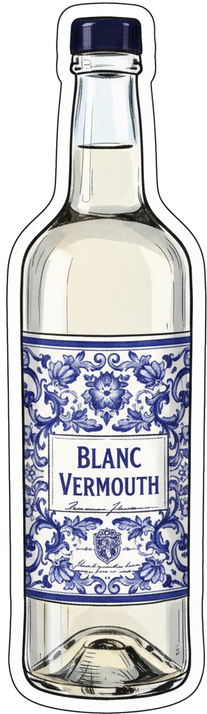
  
  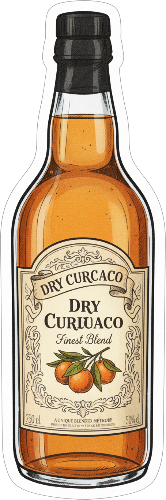
  
  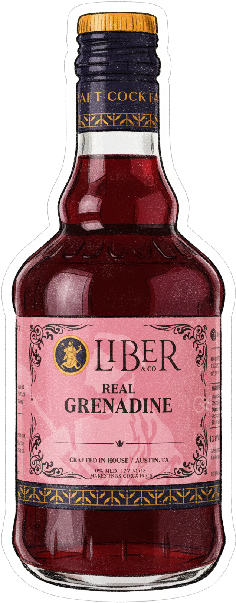
  
  
  
  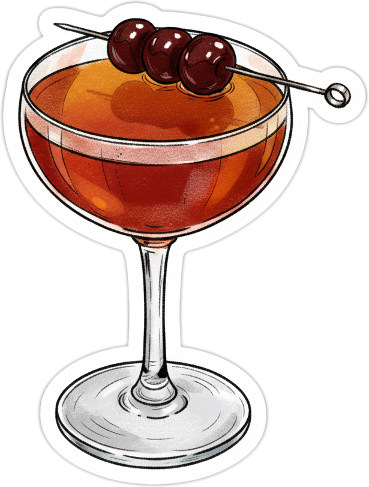
</figure>

Ingredients
: - 1 1/2oz light rum
  - 3/4oz blanc or dry vermouth
  - 1/4oz orange liqueur
  - 1 barspoon real grenadine

Method
: Stir in mixing glass with ice. Strain.

Serving and Garnish
: Cocktail glass, up

Good Bottles
: Diplomatico Planas, Probitas, El Dorado 3, Planteray 3 Stars. Lillet Blanc, Dolin Vermouth Blanc.

### Mai Tai

<figure class="popout cocktail-spec">
  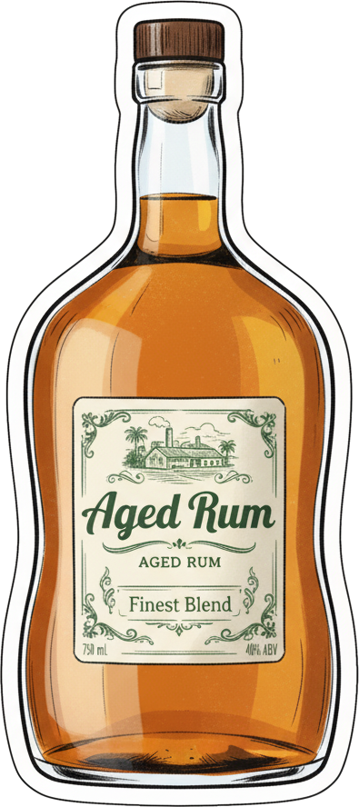
  
  
  
  
  
  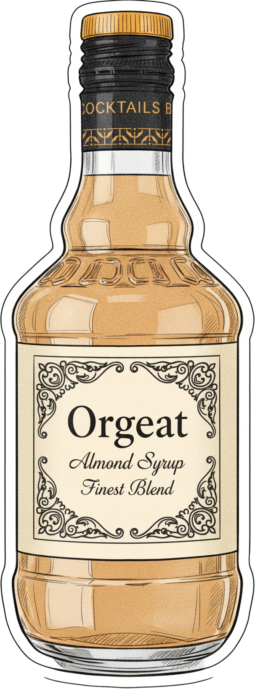
  
  
  
  
  
  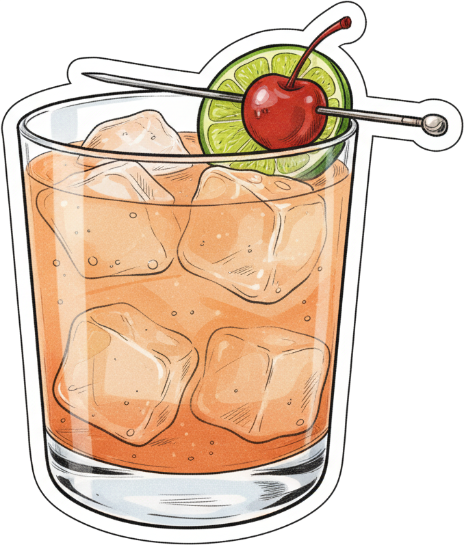
</figure>

Ingredients
: - 2oz rum (often split: 1oz Jamaican funky rum + 1/2oz agricole blanc + 1/2oz aged dark rum)
  - 1oz lime juice
  - 1/2oz dry curacao
  - 1/2oz orgeat
  - 1/8&ndash;1/4oz simple / demerara syrup

Method
: Shake with ice. Double strain.

Serving and Garnish
: Large rocks glass, ice pebbles, lime peel

Good Bottles
: Appleton Estate 8 / 12 / 15, El Dorado 8, Smith and Cross. Pierre Ferrand Dry Curacao.

Riffs
: - [*"Hotel" Mai Tai*](https://www.youtube.com/shorts/p66qPFQG-wY) (from the NoMad Cocktail Book): small lime wedge, 1oz lime juice, 3/4oz orgeat, 1/2oz creole shrubb (orange liqueur), 1/2oz rhum agricole (Rhum J.M Blanc Agricole Martinique 100 Proof), 3/4oz Appleton Signature (4 year blend), 3/4oz El Dorado 15 (highly aged dark rum)
  - *Trader Vic's spec*: 1 1/2oz Smith and Cross, 1/2oz Agricole Blanc, 1/2oz Pierre Ferrand Dry Curacao, 3/4oz lime juice, 1/2oz orgeat

### Gimlet

<figure class="content cocktail-spec">
  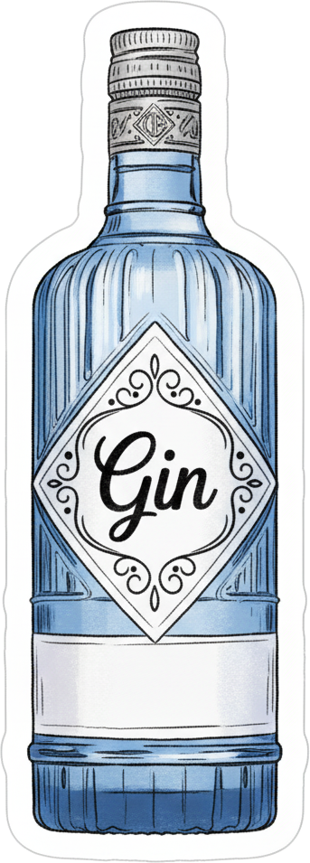
  
  
  
  
  
  
  
  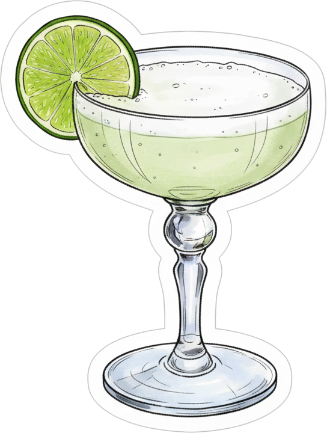
</figure>

Ingredients
: - 2oz gin
  - 1/2&ndash;3/4oz lime juice
  - 1/2&ndash;3/4oz simple syrup

Method
: Shake with ice. Double strain.

Serving and Garnish
: Nick and nora or coupe, up, lime wheel garnish

Good Bottles
: Citadelle, Hendrick's, Tanqueray No. Ten, Tanqueray Rangpur, Bluecoat, Monkey 47, Junipero, Barr Hill, Isle of Harris, Roku Gin (Japanese), Gin Mare (Spanish, exotic, olives), Empress 1908 Indigo

Riffs
: - *Gimlet highball*: 1 1/2oz gin, 1/2oz lime juice, 1/4&ndash;1/2oz simple syrup. Shake and pour. Top with 3&ndash;4oz club soda.

### Negroni

<figure class="content cocktail-spec">
  
  
  
  
  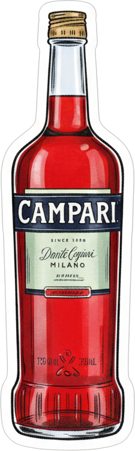
  
  
  
  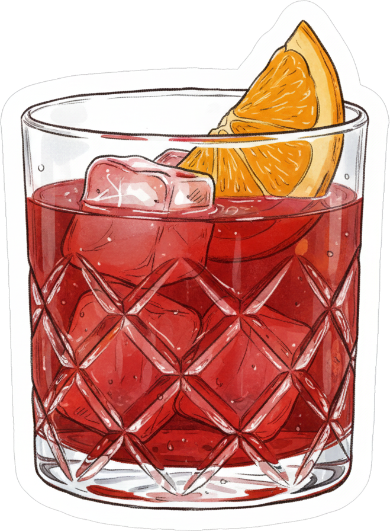
</figure>

Ingredients
: - 1oz gin
  - 1oz sweet vermouth
  - 1oz Campari

Method
: Stir in mixing tin with ice. Strain.

Serving and Garnish
: Rocks glass, one large ice cube, orange peel garnish

Good Bottles
: Cocchi Vermouth di Torino, Cinzano Rosso Vermouth, Carpano Antica Formula, Dolin Rouge Sweet. Tanqueray No. 10.

Riffs
: - *MonteNegroni*: swap Campari for Amaro Montenegro. 2oz Amaro Montenegro, 1oz gin, 1oz sweet vermouth, 2 dashes Angostura bitters.
  - *Kingston Negroni*: 1oz Jamaican rum (Smith and Cross), 1oz sweet vermouth, 1oz Campari

### Martini

<figure class="content cocktail-spec">
  
  
  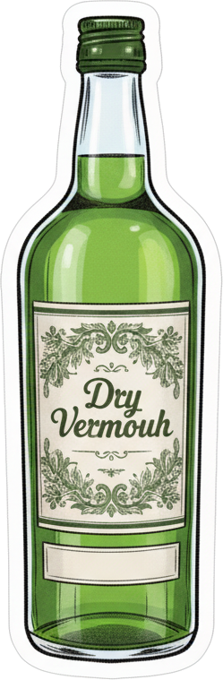
  
  
  
  
  
  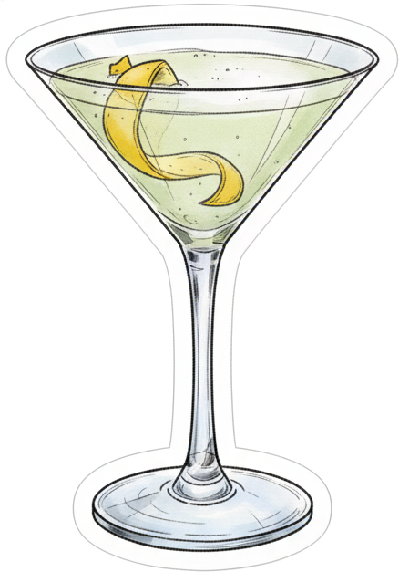
</figure>

Ingredients
: - 2oz gin
  - 1/2&ndash;3/4oz dry vermouth
  - 1 dash orange bitters

Method
: Stir in mixing tin with ice. Strain. (Optionally shake)

Serving and Garnish
: Martini glass, up, lemon peel / green olive garnish

Good Bottles
: Plymouth, Bluecoat. Dolin Dry, Noilly Prat Extra Dry.

Riffs
: - *Perfect Martini*: add 1/2&ndash;3/4oz sweet vermouth to the tin

### Lemon Drop

<figure class="popout cocktail-spec">
  
  
  
  
  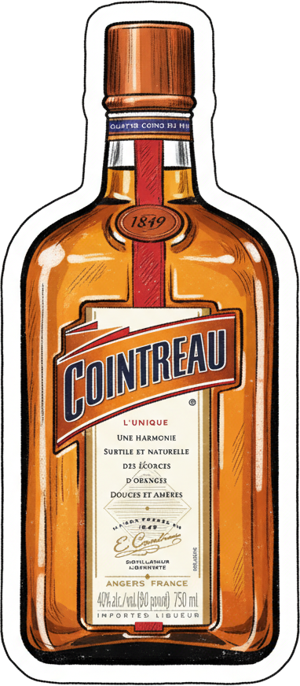
  
  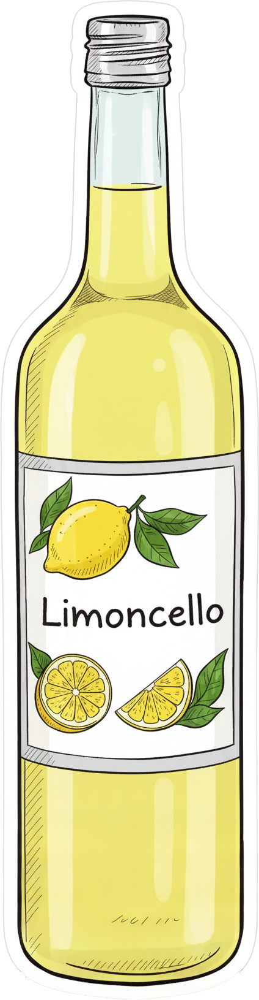
  
  
  
  
  
  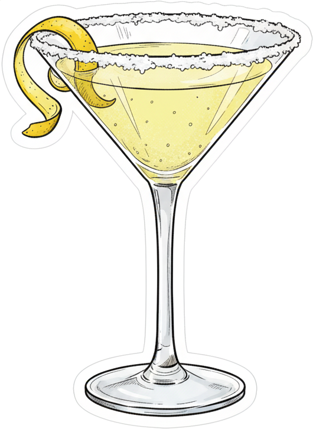
</figure>

Ingredients
: - 1 1/2oz gin
  - 3/4oz lemon juice
  - 1/2oz triple sec (sub 1oz limoncello + 1/4oz triple sec)
  - 1/4&ndash;1/2oz simple syrup
  - (Optional) one dash orange bitters
  - (Optional) pinch of salt

Method
: Shake with ice. Double strain.

Serving and Garnish
: Coupe glass, up. Lemon twist or lemon wheel for garnish.

Good Bottles
: Plymouth, Tanqueray No. 10.

### Boulevardier

<figure class="content cocktail-spec">
  
  
  
  
  
  
  
  
  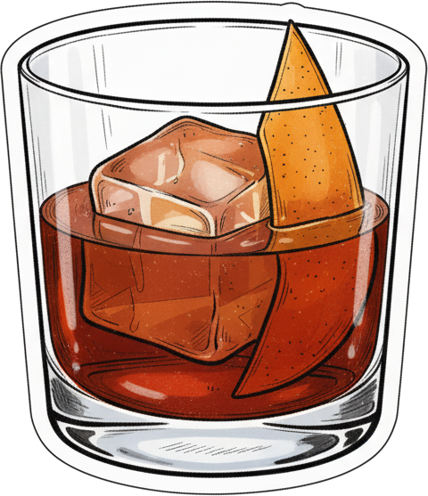
</figure>

Ingredients
: - 1 1/2oz bourbon
  - 3/4&ndash;1oz Campari
  - 3/4&ndash;1oz sweet vermouth
  - (Optional) small pinch of salt

Method
: Stir in mixing tin with ice. Strain. The classic recipe uses 1oz Campari and vermouth, but using 3/4oz Campari and vermouth may be better.

Serving and Garnish
: Rocks glass or coupe, one large ice cube, orange peel garnish

Good Bottles
: Same Vermouths as the Negroni. Buffalo Trace, Elijah Craig Small Batch.

### Sidecar

<figure class="popout cocktail-spec">
  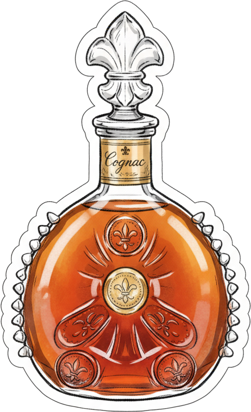
  
  
  
  
  
  
  
  
  
  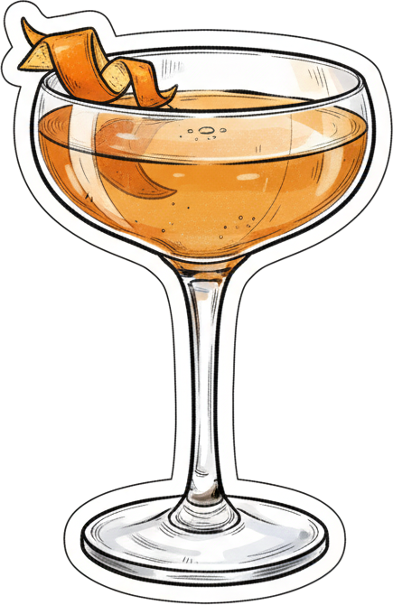
</figure>

Ingredients
: - 1 1/2&ndash;2oz Cognac / brandy
  - 1/2oz Cointreau
  - 3/4oz lemon juice
  - 1/4&ndash;1/3oz simple syrup
  - Tiny pinch of salt

Method:
: Shake with ice. Double strain.

Serving and Garnish
: Coupe, up. Garnish with an orange or lemon twist.

Good Bottles
: Pierre Ferrand Ambre, Pierre Ferrand 1840 Original Formula, Hennessy VS, Remy Martin VSOP

Riffs
: - *Gennaro's sidecar*: 1oz Cognac, 3/4oz Cointreau, 1/2oz limoncello, 1/2oz lemon juice
  - *Champs-Elysees*: 2oz Cognac, 1/2oz Green Chartreuse, 3/4oz lemon juice, 1/4&ndash;1/2oz simple syrup, 2 dashes Angostura bitters

### Between the Sheets

<figure class="popout cocktail-spec">
  
  
  
  
  
  
  
  
  
  
  
  
  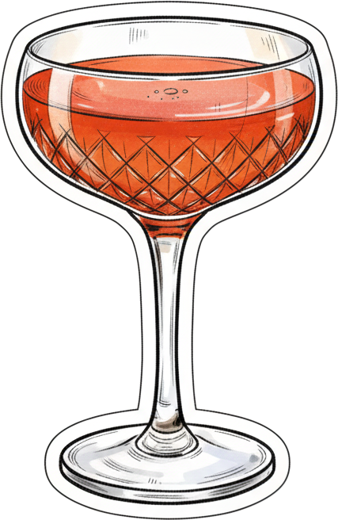
</figure>

Ingredients
: - 1oz cognac
  - 1oz light rum
  - 1oz triple sec (Cointreau)
  - 1/4oz lemon juice
  - (Optional) 1/4oz simple syrup
  - (Optional) pinch of salt

Method
: Shake with ice. Double strain.

Serving and Garnish
: Cocktail glass, up, express orange peel (no garnish)

Good Bottles
: Same cognacs as above. Planteray 3 Stars, Flor De Cana 4, El Dorado 3, Diplomatico Planas.

### Mudslide

<figure class="content cocktail-spec">
  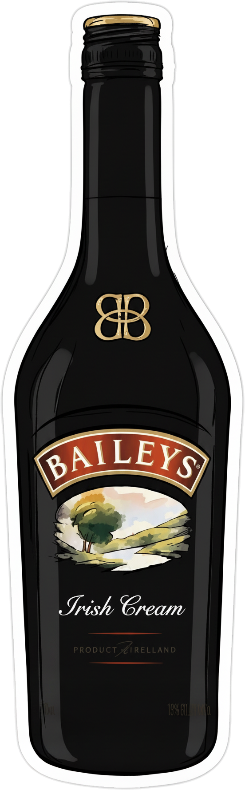
  
  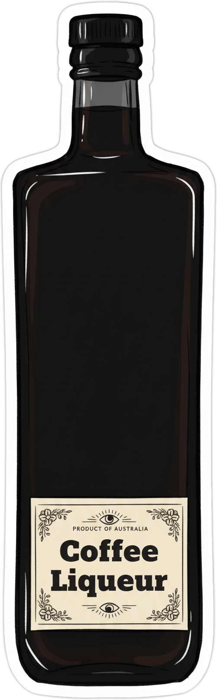
  
  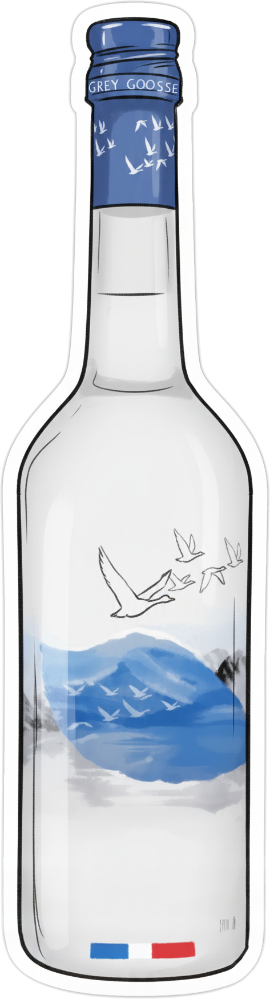
  
  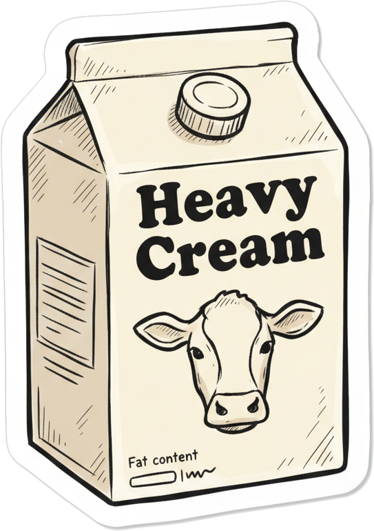
  
  
  
  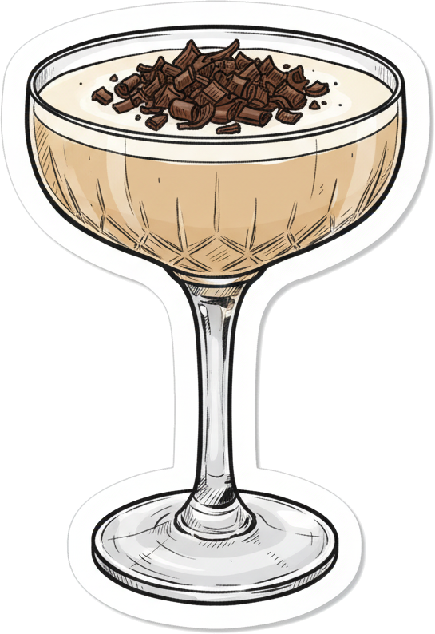
</figure>

Ingredients
: - 1oz Irish cream
  - 1oz coffee liqueur
  - 1oz vanilla vodka
  - 1 1/2oz heavy cream

Method
: Shake with ice. Double strain.

Serving and Garnish
: Rocks glass or coupe, fresh ice OR up, chocolate syrup. Garnish with shaved chocolate.

Good Bottles
: Baileys, Kahlua

### Port of Call

<figure class="popout cocktail-spec">
  
  
  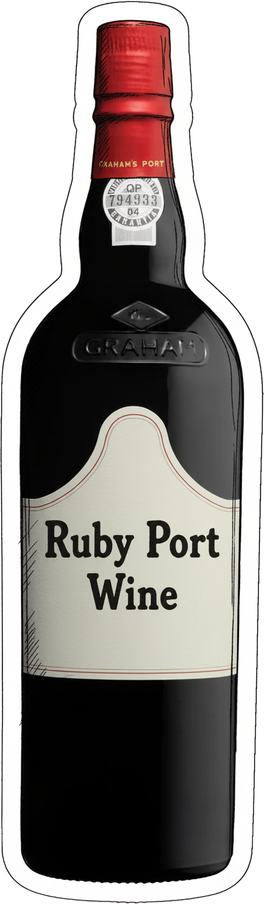
  
  
  
  
  
  
  
  
  
  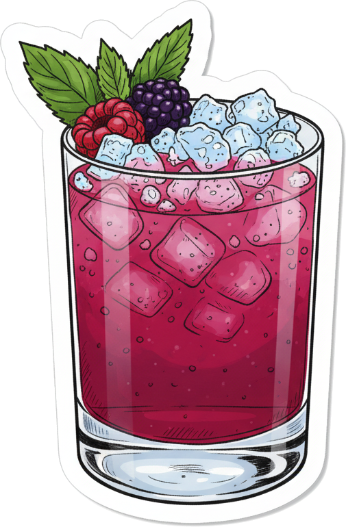
</figure>

Ingredients
: - 1oz gin
  - 1oz ruby port wine
  - 3/4oz lemon juice
  - 1/2oz cinnamon syrup
  - 1 tsp cranberry preserves

Method
: Shake with ice. Double strain.

Serving and Garnish
: Rocks glass, crushed ice, mint garnish

Good Bottles
: I have no idea

Riffs
: - If cinnamon syrup / cramberries aren't available, sub with: 1/2oz simple syrup + 1 dash Angostura bitters + dash of grenadine

### Japanese Snow Monkey

I had [this cocktail](https://www.instagram.com/p/C1IcTPbRGz3/?hl=en) at [Rumba](https://en.wikipedia.org/wiki/Rumba_(restaurant)).
The spec is given as: "Kiyomi rum, Nigori sake, Bermutto dry vermouth, Campari, raspberry, and lemon".
"A floral but punchy take on a Negroni to help brighten long winter days."
There was a particular roasted corn-like and slightly smoky flavor that was hard to pin down, but was very good.
My attempted reproduction:

<figure class="popout cocktail-spec">
  
  
  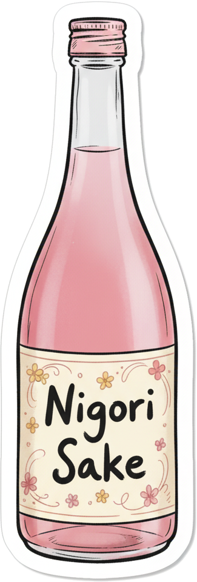
  
  
  
  
  
  
  
  
  
  
  
  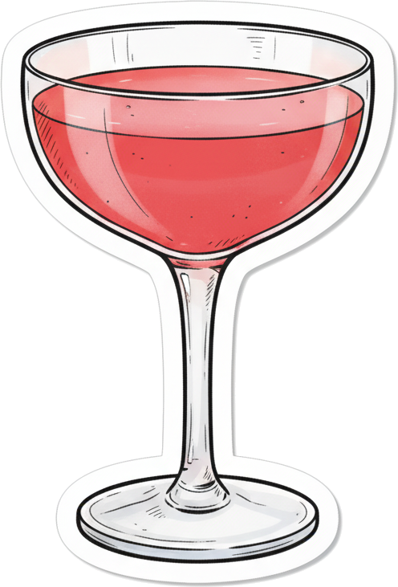
</figure>

Ingredients
: - 1oz Japanese rum (substitute with: 1/2oz Probitas + 1/4oz El Dorado 3 + 1/4oz agricole blanc)
  - 1oz Nigori sake
  - 3/4oz dry vermouth
  - 1/2oz Campari
  - 1/2oz raspberry syrup **OR** muddle 6-8 raspberries with 1/4oz simple syrup
  - 1/2oz lemon juice
  - Sprinkle of salt
  - (Optional) 3-4 drops of mezcal (for slight smoke)

Method
: Muddle raspberries. Shake with ice. Double strain.

Serving and Garnish
: Coupe, up.

Good Bottles
: Probitas. Tozai Snow Maiden, Sho Chiku Bai Nigori.

### Last Word

<figure class="content cocktail-spec">
  
  
  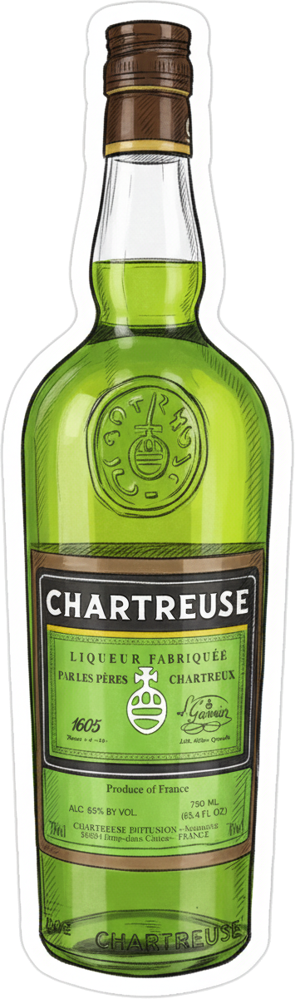
  
  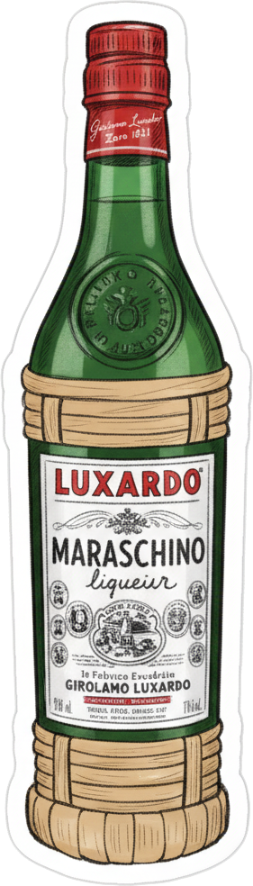
  
  
  
  
  
  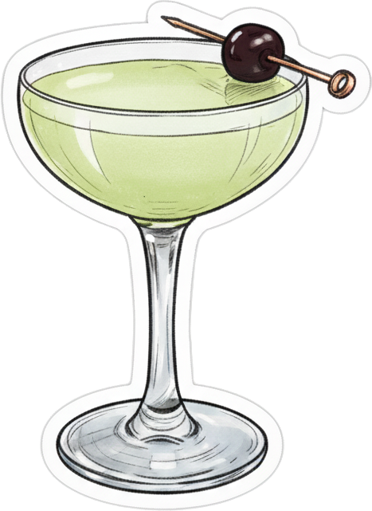
</figure>

Ingredients
: - 3/4oz gin
  - 3/4oz Green Chartreuse
  - 3/4oz Maraschino liqueur
  - 3/4oz lime juice

Method
: Shake with ice for 20-30 seconds. Double strain.

Serving and Garnish
: Coupe / nick and nora, up. Garnish with Luxardo cherry + lime twist.

Riffs
: - It seems widely recognized that it is better to go lower on Maraschino and up on gin for better balance: 1oz gin + 1/2oz Maraschino liqueur.

### Bee's Knees

<figure class="content cocktail-spec">
  
  
  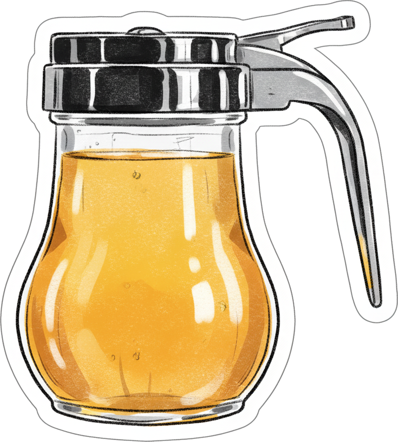
  
  
  
  
  
  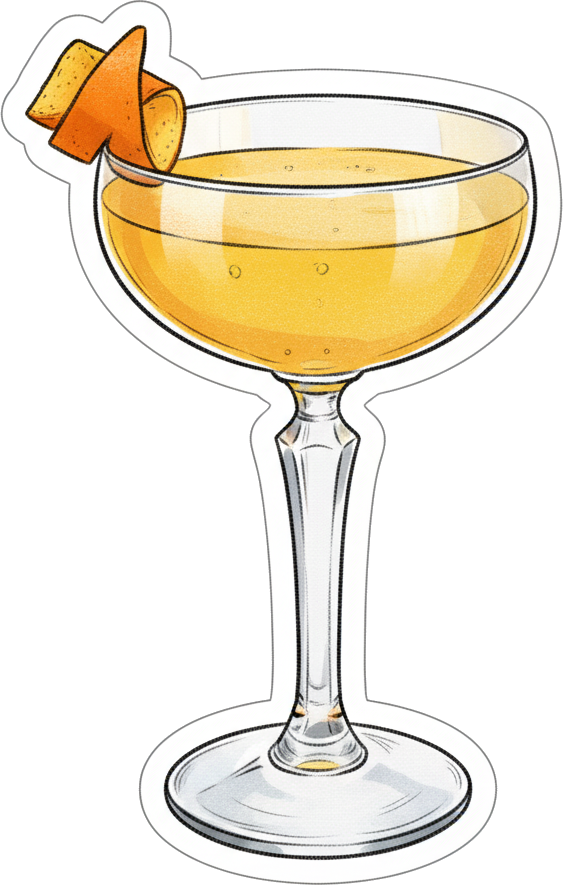
</figure>

Ingredients
: - 2oz gin
  - 3/4oz honey syrup (equal parts honey and warm water, stir until mixed and cool)
  - 3/4oz lemon juice
  - (Optional) splash of fresh lemonade

Method
: Shake with ice for 15 seconds. Double strain.

Serving and Garnish
: Coupe / nick and nora, up. Garnish with lemon twist.

### Jasmine

<figure class="popout cocktail-spec">
  
  
  
  
  
  
  
  
  
  
  
  
  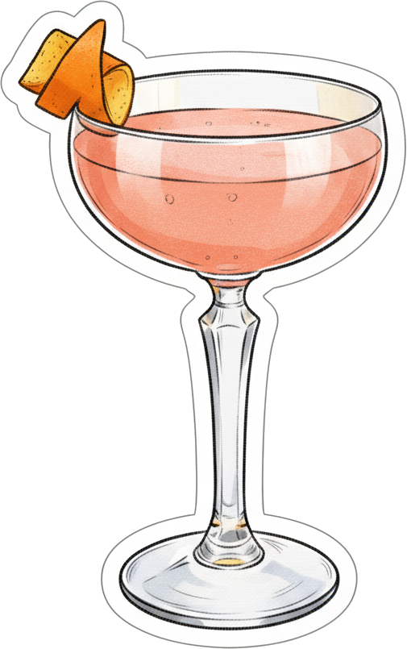
</figure>

Ingredients
: - 1 1/2oz gin
  - 1/4oz Campari
  - 1/4oz orange liqueur (Cointreau)
  - 3/4oz lemon juice
  - 1/8&ndash;1/4oz simple syrup

Method
: Shake with ice for 15-20 seconds. Double strain.

Serving and Garnish
: Coupe, up. Garnish with lemon twist.

### Monkey Gland

<figure class="popout cocktail-spec">
  
  
  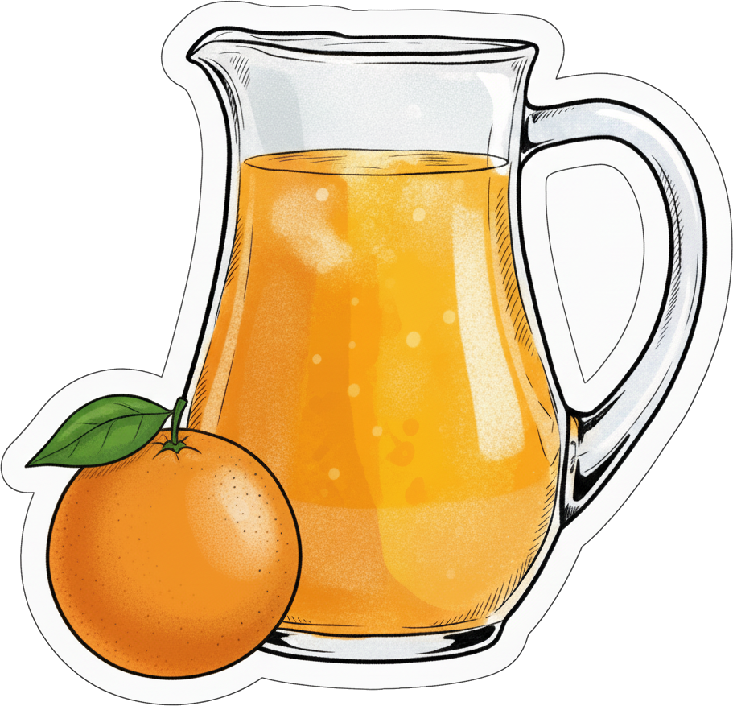
  
  
  
  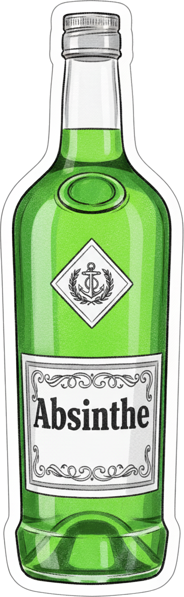
  
  
  
  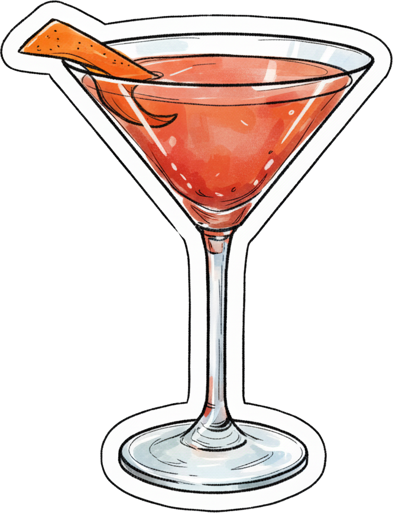
</figure>

Ingredients
: - 1 1/2oz gin
  - 1oz fresh orange juice
  - 1/4oz grenadine
  - 1 dash absinthe

Method
: Shake with ice. Double strain.

Serving and Garnish
: Martini glass or coupe, up. Garnish with orange twist or wheel.

### Corpse Reviver \#2

<figure class="popout cocktail-spec">
  
  
  
  
  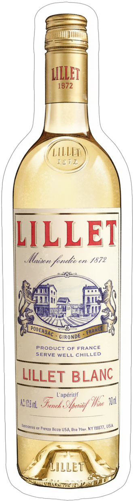
  
  
  
  
  
  
  
  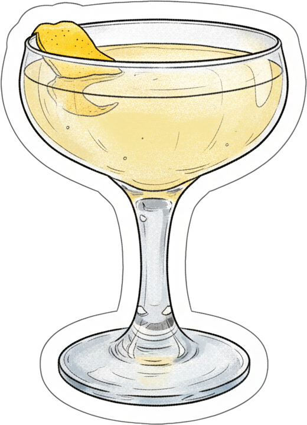
</figure>

Ingredients
: - 3/4oz gin
  - 3/4oz orange liqueur (Cointreau)
  - 3/4oz Lillet Blanc
  - 3/4oz lemon juice
  - 1 dash absinthe for rinsing the glass

Method
: Spray the glass with absinthe. Shake ingredients with ice for 15 seconds. Double strain.

Serving and Garnish
: Coupe, up. Garnish with lemon or orange twist.

### Martinez

<figure class="content cocktail-spec">
  
  
  
  
  
  
  
  
  
  
  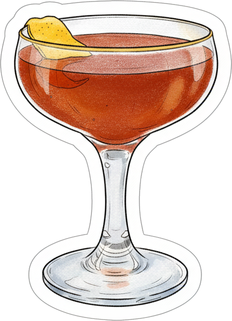
</figure>

Ingredients
: - 1 1/2oz gin
  - 1 1/2oz sweet vermouth
  - 1/4oz Luxardo maraschino liqueur
  - 2 dashes Angostura bitters

Method
: Stir over ice until chilled, 30-45 seconds. Strain.

Serving and Garnish
: Coupe, up. Garnish with lemon twist.

### Bijou

<figure class="content cocktail-spec">
  
  
  
  
  
  
  
  
  
  
  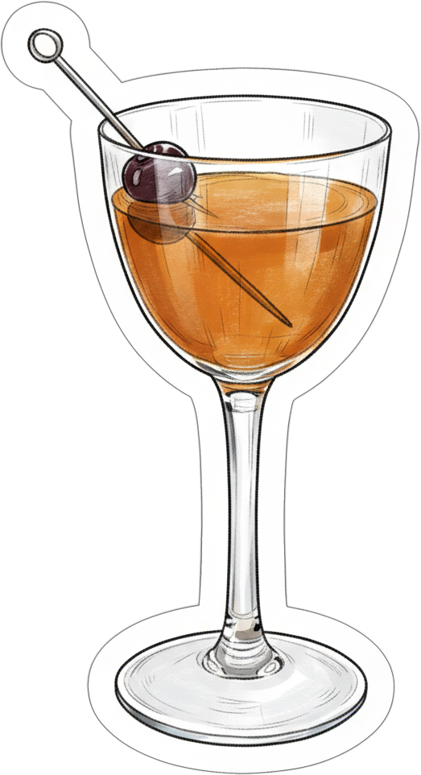
</figure>

Ingredients
: - 1 1/2oz gin
  - 1oz sweet vermouth
  - 3/4oz Green Chartreuse
  - 2 dashes orange bitters

Method
: Stir over ice until chilled, 20-30 seconds. Strain.

Serving and Garnish
: Nick and nora, up. Garnish with cherry.

### Aviation

<figure class="content cocktail-spec">
  
  
  
  
  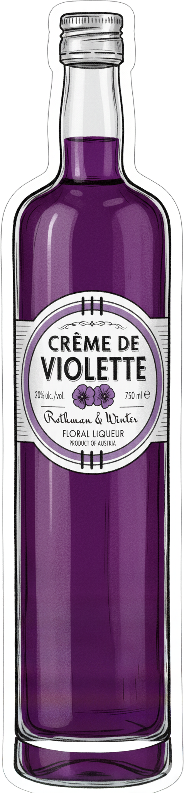
  
  
  
  
  
  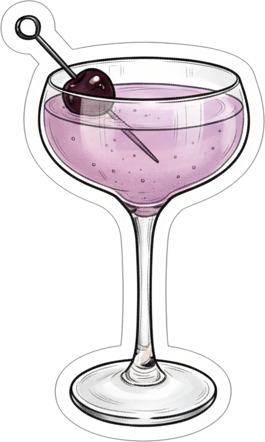
</figure>

Ingredients
: - 1 3/4oz gin
  - 1/2oz Luxardo Maraschino liqueur
  - 1/4oz Creme de Violette Liqueur
  - 1/2oz lemon juice
  - 1/4oz cold water (omit if using wet ice)

Method
: Shake with ice until chilled, 10-15 seconds. Double strain.

Serving and Garnish
: Nick and nora or martini glass, up. Garnish with cherry or lemon twist.

<!--
- Can use 1/4oz simple syrup
- Creme Yvette
-->

### Paper Plane

<figure class="content cocktail-spec">
  
  
  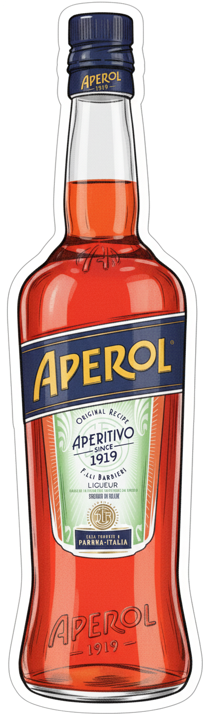
  
  
  
  
  
  
  
  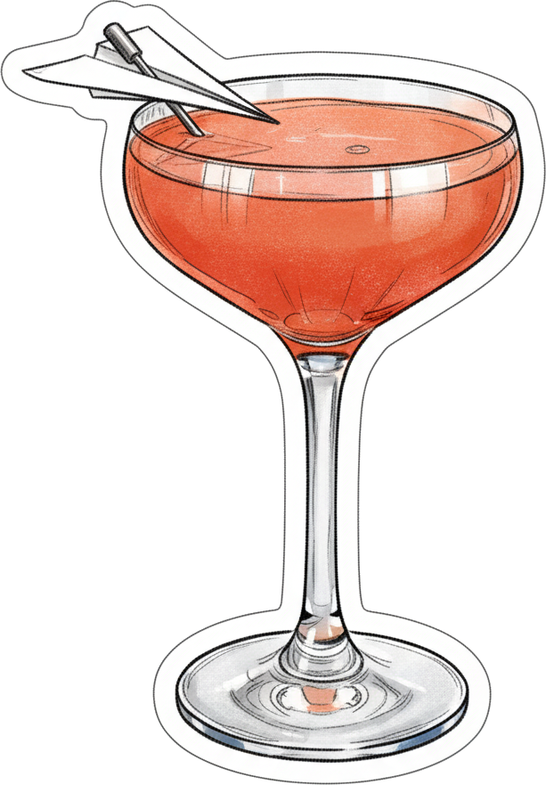
</figure>

Ingredients
: - 3/4oz bourbon
  - 3/4oz Aperol
  - 3/4oz Amaro Montenegro (typically Amaro Nonino is used)
  - 3/4oz lemon juice

Method
: Shake with ice until chilled, 10-15 seconds. Double strain.

Serving and Garnish
: Nick and nora or coupe glass, up.

Riffs
: - Use a different amaro (e.g. Nonino, Averna)

### Spritz

<figure class="content cocktail-spec">
  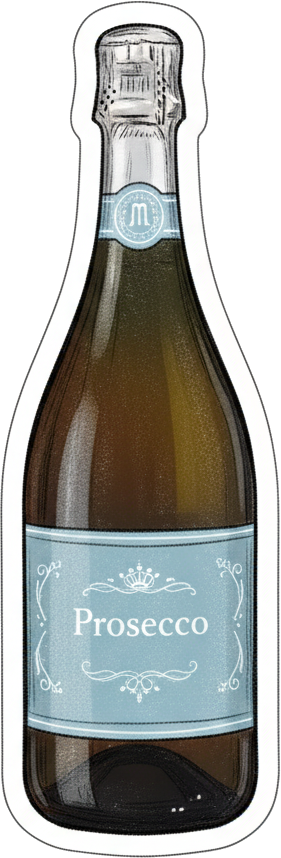
  
  
  
  
  
  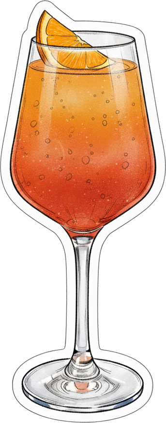
</figure>

Ingredients
: - 3oz dry sparkling wine (e.g. Prosecco)
  - 2oz amaro (e.g. Aperol, Amaro Montenegro, Campari)
  - 1oz soda water
  - (Optional) 1/4oz lemon juice

Method
: Use the classic 3-2-1 spritz formula and improvise the ingredients! In the glass, first add wine, then slowly drop in ice, then amaro, and finally soda water. Stir once.

Serving and Garnish
: Serve in a wine glass. Garnish with a slice of orange.

Riffs
: - *Hugo spritz*: Muddle 8-10 mint leaves with 1 lime wedge and 1.5oz Elderflower liqueur. Top with ice. Pour 2&ndash;3oz Prosecco + 2oz sparkling water.

### Gin Fix

<figure class="content cocktail-spec">
  
  
  
  
  
  
  
  
  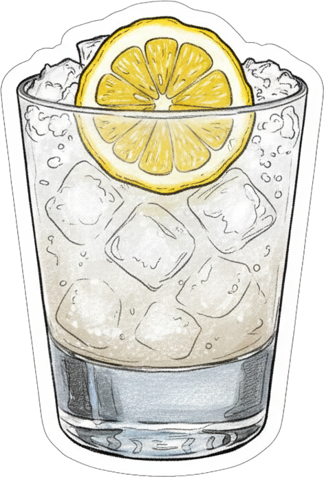
</figure>

Ingredients
: - 2oz gin
  - 1/2oz simple syrup
  - 1oz lemon juice

Method
: Shake with ice. Double strain.

Serving and Garnish
: Highball or rocks glass, fill glass with crushed ice. Stir after pouring. Garnish with lemon peel.

<!--
Occasion: summer, midday-spritz
-->

### White Negroni

<figure class="content cocktail-spec">
  
  
  
  
  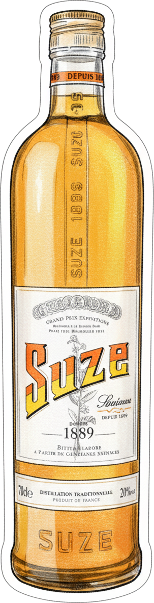
  
  
  
  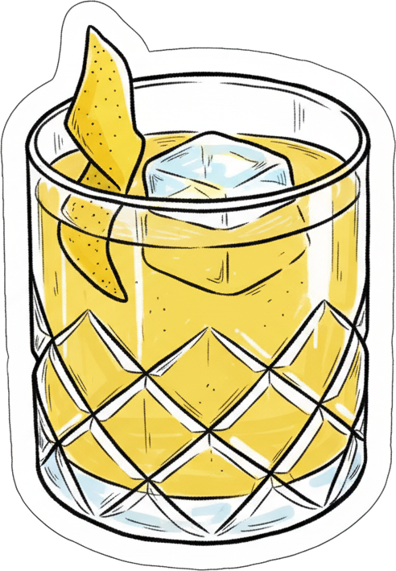
</figure>

Ingredients
: - 1 1/2oz gin
  - 1oz Lillet Blanc
  - 1/2oz Suze

Method
: Stir over ice. Strain.

Serving and Garnish
: Rocks glass. Garnish with a lemon twist.

Riffs
: - *Alpine Negroni*: 1oz gin, 3/4oz Cocchi Americano, 3/4oz Suze, 1/2oz Dolin Genepy, 1 barspoon White Creme de Menthe, 3 dashes lemon bitters, sprinkle of salt.

### Elk's Own

<figure class="popout cocktail-spec">
  
  
  
  
  
  
  
  
  
  
  
  
  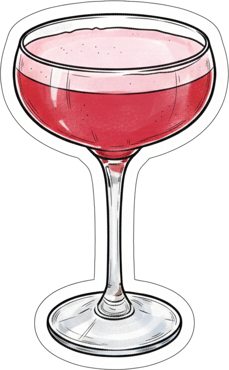
</figure>

Ingredients
: - 1oz whiskey
  - 3/4oz Ruby Port
  - 3/4oz lemon juice
  - 1/2oz demerara syrup
  - 1&ndash;2 dashes chocolate / orange bitters
  - Egg white / Fee foam

Method
: Shake with ice. Double strain.

Serving and Garnish
: Nick and Nora glass.

<!--
Occasion: Winter
-->

### Jungle Bird

<figure class="popout cocktail-spec">
  
  
  
  
  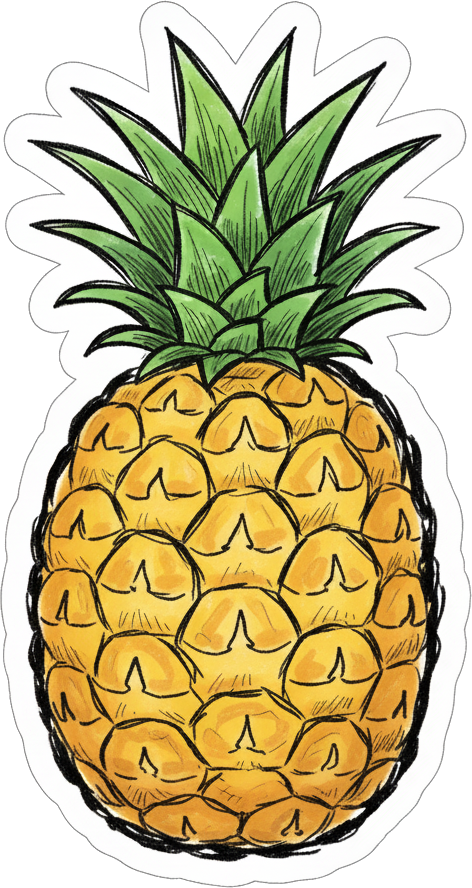
  
  
  
  
  
  
  
  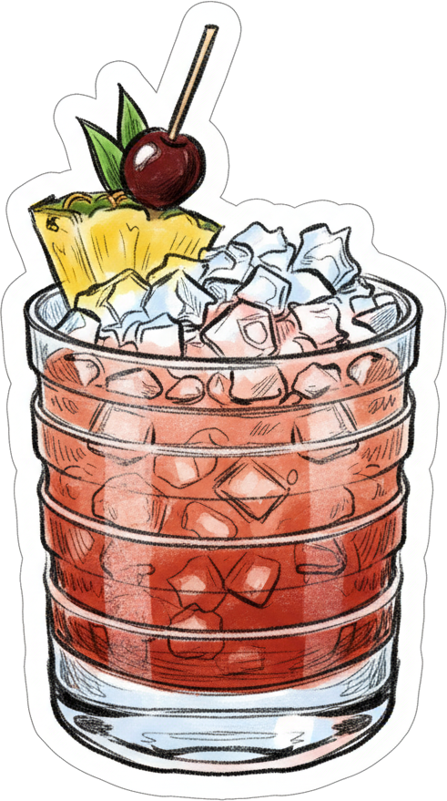
</figure>

Ingredients
: - 1 1/2oz dark rum
  - 1/2oz Campari (or Aperol for less bitterness)
  - 1 1/2oz pineapple juice
  - 1/2oz lime juice
  - 1/2oz simple syrup

Method
: Shake hard with pebble ice. Ungated pour into glass.

Serving and Garnish
: Fill a rocks glass with pebble ice and pour. Garnish with slices of lime and orange.

Good Bottles
: Rhum Barbancourt, Smith and Cross, Appleton Estate 8/12

### French 75

<figure class="content cocktail-spec">
  
  
  
  
  
  
  
  
  
  
  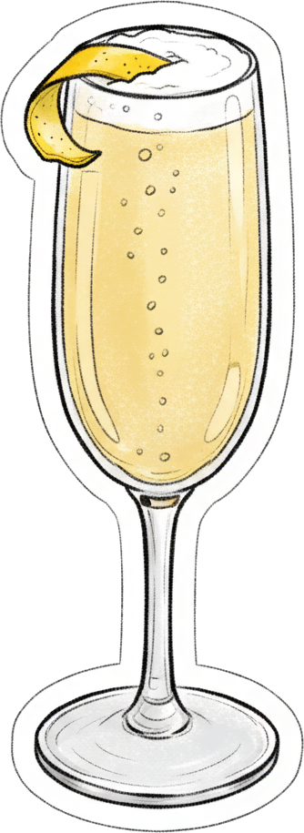
</figure>

Ingredients
: - 1oz gin
  - 1/2oz simple syrup
  - 1/2oz lemon juice
  - 3&ndash;4oz Brut Champagne / dry sparkling wine

Method
: Shake gin + syrup + lemon juice with ice. Pour into flute. Top off with Champagne.

Serving and Garnish
: Serve in Champagne flute, up. Garnish with lemon twist

Good bottles
: Empress 1908 Elderflower Rose Gin, Empress 1908 Indigo Gin, Hendrick's

Riffs
: - *French 125*: Sub gin with cognac.
  - *French 95*: Sub gin with bourbon.
  - Sub simple syrup for Elderflower liqueur
  - Other interesting riffs can be [found here](https://www.reddit.com/r/cocktails/comments/cfi4m8/anyone_have_a_detailed_recipe_for_a_french_75/)

### Poet's Dream

<figure class="content cocktail-spec">
  
  
  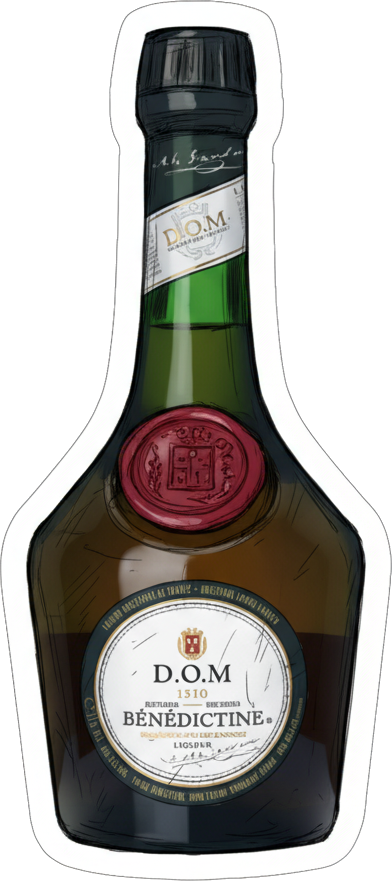
  
  
  
  
  
  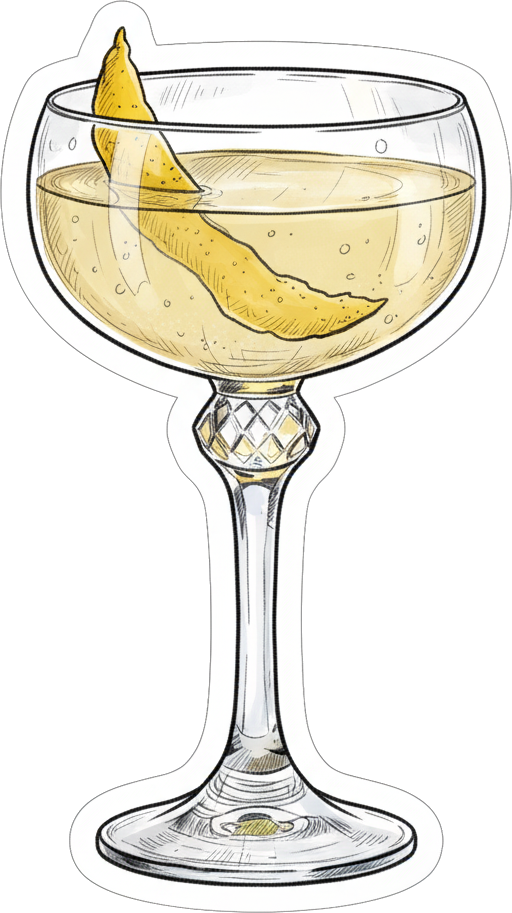
</figure>

Ingredients
: - 3/4oz gin
  - 1/2oz Benedictine
  - 3/4oz dry vermouth
  - (Optional) touch of dry curacao

Method
: Stir on ice. Double strain into chilled glass.

Serving and Garnish
: Nick and Nora glass, up. Garnish with lemon peel

<!-- Ideal aperitif -->

### Adriatique

<figure class="content cocktail-spec">
  
  
  
  
  
  
  
  
  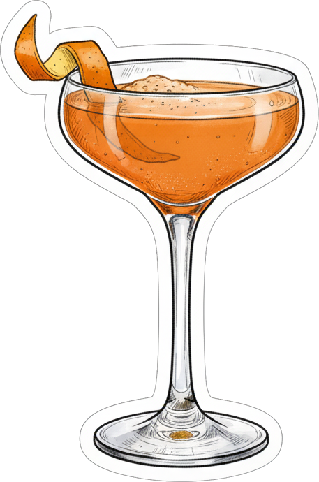
</figure>

Ingredients
: - 1oz Amaro Montenegro
  - 1/2oz Aperol
  - 1oz orange juice

Method
: Shake with ice. Double strain.

Serving and Garnish
: Nick and Nora glass, up. Orange peel garnish.

Riffs
: - *A more balanced version*: (1) Add 1/4oz lemon juice to boost the acidity of the orange juice. (2) Replace the Aperol with Campari. (3) Add 1/8oz of simple syrup.
  - *Spritz version*: Top off the base cocktail with 3&ndash;4oz of dry sparkling white wine (e.g. Prosecco) or seltzer

<!-- Ideal aperitif -->

### Americano

<figure class="content cocktail-spec">
  
  
  
  
  
  
  
</figure>

Ingredients
: - 1 1/2oz Amaro (e.g. Campari, Amaro Montenegro, Aperol &mdash; if sweetness is desired)
  - 1 1/2oz sweet vermouth
  - 2&ndash;3oz seltzer
  - (Optional) 1&ndash;2 dashes orange bitters

Method
: Pour Amaro and vermouth over ice in glass. Stir until chilled. Top with seltzer. One final stir.

Serving and Garnish
: Highball glass, filled with large cubed ice. Garnish with orange wheel / lemon twist.

<!-- Another very ideal aperitif - pair with Castelvetrano olives, Parmigiano Reggiano shards, Warm focaccia -->

## Poison Reviews

Here are things I've tried and what I think.
*To be clear*: I have no actual taste in alcohol.
Total amateur opinions to follow.

### Whiskey

- *Maker's Mark 46*. (6/10). I like it. Good enough neat.
- *Woodford Reserve (Regular)*. (4/10). Pretty good, but I prefer Maker's 46 over this. Not so great anymore after having better whiskeys.
- *Suntory Toki*. (6/10). I really like it when mixed. Ideal for highballs and sours. Not great neat.
- *Four Roses Small Batch*. (8/10). The best so far. Excellent. Very smooth and flavorful. Very enjoyable neat. Spending more on bourbon (at least $40 for a 750ml bottle) seems to be worth it.
- *Redbreast 12*. TBD.
- *Michter's US1*. TBD.

### Rum

- *Diplomatico Reserva Exclusiva*. (7/10). I like it. A few feel it is too harsh and doesn't go down smooth, at least neat. But I'm a fan.
- *El Dorado 3*. (6/10). Slight hint of fruity/tropical flavor but overpowered by a pure alcohol aftertaste. Reasonably OK in daiquiris, but not my favorite.
- *Clement Rhum Agricole Blanc.* (9/10). Absolutely essential for a daiquiri. A great flavor enhancer with notes of banana and tropical fruits + sweetness.
- *Probitas*. (9/10). This goes very well in a daiquiri. Strong flavors of ripe banana and pineapple. Strong at 48%: I recommend some explicit dilution of 1/4oz chilled water in a daiquiri + a touch more than 3/4oz simple syrup.
- *Planteray 3 Stars*. TBD.
- *Appleton Estate 8*. TBD.

<!--
- [x] El Dorado needs agricole for sure, not a very rum-forward flavor though - mostly alcohol
- [x] Probitas is excellent, nice banana and tropical flavors, especially with agricole it gets even better. however it is a bit too harsh, i would add a bit over 3/4oz syrup and a bit (maybe 1/4oz) of chilled water to tame the alcohol burn. the flavor however is excellent and this is a great daiquiri
-->

### Soju

- *Hwayo 25 Soju*. (5/10). Has an initial taste much closer to sake than soju, but still inferior to sake. Good to try, but the aftertaste is still too alcoholic.
- *Ilpoom Jinro Oak 43 Soju*. TBD.

### Gin

- *Citadelle Gin*. (9/10). Excellent 'celery'-like + juniper berry flavor, freshness as the final note. Gimlet with this is too good.
- *Hendrick's Gin.* (8/10). Also very good, but more subtle finish and harsher down the throat vs Citadelle.
- *Barr Hill Gin*. (8/10). This is a very classic gin with mainly juniper notes. There is a hint of honey, but it needs a honeyed cocktail to make it stand out.

### Wines

#### Port

- *Porto Morgado Old Tawny (10 Years)*. (7/10). Sits around $10 from Trader Joe's. Hits way way above its price point. We love this.
- *Porto Morgado Ruby*. (5/10). Not as good. Similar price point, but much worse than above imo.
- *Fairbanks Cellars California Port (1.5L)*. (2/10). Cheap but bad. Stay away.
- *Warre's Otima 10 Tawny Porto*. TBD.

#### Reds

- *Decoy Cabernet*. (5/10). Decent, hits a bit above its price point, but it's better to spend more.
- *Sean Thackrey Pleiades XXXII*. (9/10) Very good. Fruity and smooth.
- *Charles Shaw wines (all varieties)*. (3/10). Very cheap, but do not buy lol. Get something nicer.
- *No Es Pituko Carignan 2024*. (8/10). So so smooth, hard to believe there was any alcohol at all. Excellent.
- *Domaine de la Patience, Red (2023)*. (8/10). Another smooth and gulpable red.
- *Love Red 2022 - Broc Cellars*. (7/10). Similar to the other smooth red wines. Light flavor, very smooth, hardly any taste of alcohol. I think I need something more flavorful next time.
- *Chateau Pey-Bonhomme Le-Tours Merlot*. TBD.
- *Folk Machine Pinot Noir*. TBD.

#### Whites

- *2021 Virgo Magic Wines 'Disco Lemonade' Riesling*. (5/10). Tastes heavily like brined olives. I think this is an acquired taste, not for a general audience.
- *Barefoot Moscato*. (2/10). Cheap, mild tasting, and gulpable. Get something nicer.
- *Risata Moscato d'Asti DOCG*. (8/10). Low alcohol, smooth, sweet, and fruity. A crowd favorite.
- *2023 Nickel & Nickel Grand Sky Vineyard Chardonnay*. (9/10) Incredibly good, smooth, bright lime aftertaste.
- *2024 Elio Perrone Moscato d'Asti Sourgal*. (6/10). Sparkling, sweet, honeyed, light. A bit too low alcohol, and perhaps too smooth. No complex flavors.
- *Belvino Prosecco Extra Dry*. (5/10). Cheap and just OK. Good for mixing in a spritz.

#### Orange

- *2023 Suisun Valley Assyrtiko, Hydrangea Skin-Contact*. (8/10). Excellent.
- *Pielihueso Naranjo 2024*. (9/10). Very very good. Smooth, slightly fruity, and crisp. Best served cold.
- *2023 Gulp Hablo Orange (1L)*. TBD.

#### Meads

- The [Remeadies](https://www.remeadies.com/) meadery near Sequoia National Park is very good. Go there if nearby. Unfortunately, their meads aren't easily available in NorCal.
- *Chaucer's Mead*. (6/10). Very vanilla alcoholic honey flavor, smooth. Nothing objectionable, but nothing special either. Good for the price.
- *Sky River Sweet Mead*. (7/10). At $30 it is expensive for what it is. Much more complex mead with a barnyard / wet grass flavor and floral notes. Not appreciated by everyone.
- *Carroll's Mead*. (7/10). A bit more honeyed vs Chaucer's, but still relatively cheap. Smooth and tasty.

### Sake

[Takara Sake](https://www.takarasake.com) has a sake factory in Berkeley, CA!
I highly recommend visiting them and doing a tasting.
What follows are all sakes from Takara (brewed in Berkeley).

- *Sho Chiku Bai REI Junmai Daiginjo*. (8/10). One of our favorites. Cheap and good, serve chilled, crisp, fruity, and smooth. If it is too old, it will acquire a mushroom-y flavor.
- *Sho Chiku Bai Organic Nama*. (6/10). Good chilled, but has an earthy flavor. Not suitable for a general audience.
- *Sho Chiku Bai Takara Sierra Cold*. (7/10). This is an insane sake. Serve chilled. 12% ABV but tastes like zero! Very light flavor of slight sweetness and fruit, but mostly tasteless.
- *Sho Chiku Bai Nigori Crème de Sake*. (9/10). Cream sake! One of our favorites. Serve chilled. Flavor is both fruity and earthy, more on the sweet side.
- *Sho Chiku Bai Premium Ginjo*. (6/10). An acquired taste. Earthy, mushroom-y, not suitable for everyone.
- *Sho Chiku Bai Mio Sparkling Sake*. (10/10). Low 5% ABV, crisp flavor, fruity. Everyone will love this.

### Cocktail Liquors

- *Cointreau*. It works, I have no reference point for orange liqueur.
- *Grand Marnier*. It works, great in a sidecar.
- *Baileys*. Sweet, smooth, milky. Nothing bad, but nothing great either.
- *Mr. Black Cold Brew Coffee Liqueur*. Decent, good espresso flavor.
- *TJ's Limoncello*. (8/10). Excellent, great in a lemon drop.

### Amaro + Fortified Wines

- *Dolin Rouge (Sweet) Vermouth*. (8/10). Decent, I have no comparison point. Great to drink on its own too.
- *Campari*. (7/10). Hard for a beginner to get used to its bitterness. Ease into it with ample dilution and sweeteners.
- *Aperol*. (9/10). Works great in a spritz and really boosts appetite before a meal.
- *Amaro Montenegro*. (10/10). The best thing I've ever tasted. Notes of vanilla and cola. Excellent in a spritz or just mixed with club soda (2oz amaro + 3oz soda water). This is a must buy.

### Garnishes

- *Luxadro cherries*. TBD. These are so expensive, it better be worth it.
  - Totally worth it. So delicious and the syrup is great to add to a cocktail.
- *Angostura bitters*. It is what it is, pretty good &mdash; not many other options.

## Equipment

There is some basic bar equipment that you need that I wish I had from the start.
Just buy these things.

- *Large ice cube tray*: I liked these Tovolo "King Cube" silicon trays ([Amazon link](https://www.amazon.com/dp/B01LXF6H2Y))
- *Regular ice cube tray*: I bought some "no-spill" trays from OXO ([Amazon link](https://www.amazon.com/dp/B007U256D2))
- *Jigger*: There are 2 major varieties (double-ended and angled). You need to be able to measure volumes from 1/4oz to 2oz. I think the angled jiggers are way easier to use at home with less spillage than the double-ended kind. I like this one from OXO ([Amazon link](https://www.amazon.com/dp/B00B6LUAPW)).
- *Rocks Glasses*: Of course you need glasses to serve cocktails in. Of all the varieties, I find [rocks glasses](https://en.wikipedia.org/wiki/Old_fashioned_glass) to be the most versatile, albeit not the prettiest. I bought these ones from Anchor Hocking ([Amazon link](https://www.amazon.com/dp/B00BC3MI5O)). [Coupes](https://en.wikipedia.org/wiki/Champagne_glass#Coupe) or [nick and noras](https://en.wikipedia.org/wiki/Nick_%26_Nora_(glass)) would be good next additions. If you want to splurge, [RIEDEL](https://www.riedel.com/en-us/shop/barware#sort=bestSeller) glasses are the best.
- *Citrus juicer*: I recommend a manual wood citrus reamer &mdash; I got one from OXO ([Amazon link](https://www.amazon.com/OXO-Good-Grips-Wooden-Reamer/dp/B0007VO0DA?)). Bulk juice citrus into a measuring jar and pour into your jigger. I *no longer* recommend the NorPro 523 Stainless Steel Juicer ([Amazon link](https://www.amazon.com/Norpro-Stainless-Steel-Citrus-Juice-Press/dp/B0002IBOAK)) &mdash; it doesn't squeeze the citrus completely and leaves plenty of juice behind. For longevity and to avoid aluminum flaking, I lean towards a solid stainless steel juicer. I want to try the Barfly Large Manual Juicer sometime ([Amazon link](https://www.amazon.com/Barfly-Large-Manual-Juicer-Aluminum/dp/B0B14PYCRF)).
- *Mixing tin*: There are also cocktail mixing glasses, but I prefer a stainless steel mixing vessel. I have this one from American Metalcraft ([Amazon link](https://www.amazon.com/dp/B09QQQGTWY)).
- *Hawthorne Strainer*: This OXO one is good ([Amazon link](https://www.amazon.com/dp/B0000DAQ93))
- *Cobbler shaker*: Bartenders usually use Boston shakers, but a cobbler shaker is far easier to use at home. I got this one from OXO ([Amazon link](https://www.amazon.com/dp/B07JW89TC3)). If I was OK spending $60 on this, I would buy the [YETI one](https://www.yeti.com/drinkware/barware/cocktail-shaker-20oz.html).
- *Fine mesh strainer*: I have a 3" strainer from OXO ([Amazon link](https://www.amazon.com/OXO-Grips-3-Inch-Strainer-Multicolor/dp/B001713L84))
- *Bar spoon*: Just get some cheap bar spoons, the exact model doesn't matter.
- *Corkscrew*: You need to be able to pull corks. Buy whatever is within your budget &mdash; these are all kind of the same. I have an OXO SteeL Winged Corkscrew ([Amazon link](https://www.amazon.com/OXO-Winged-Corkscrew-Removable-Cutter/dp/B074V7FG49))
- *Toothpicks*: The poor man's version of the fancy cocktail pick &mdash; used to pick up cherries placed in the glass. Unfortunately, they are often too short to place over the rim of a glass.
  - *Cocktail picks*: A substantial upgrade. Get stainless steel picks.
- *Cooler*: I use an insulated bag to hold all my ice and cold liquors, but a proper hard-case insulated cooler would be better.

## My Shelf

I keep the fortified wines, meads, and cream liqueurs in my fridge, and the rest in a cabinet.

Wine
: - Otima 10-Year Tawny Port
  - Chateau Pey-Bonhomme Le-Tours
  - Folk Machine Pinot Noir
  - Belvino Prosecco Extra Dry

Mead
: - Chaucer's Mead
  - Oliver Winery Camelot Mead Orange Blossom

Whiskey
: - Four Roses Small Batch
  - Mitcher's US*1
  - Redbreast 12 Year

Rum
: - Diplomatico Reserva Exclusiva
  - Appleton Estate 8
  - El Dorado 3
  - Probitas
  - Clement Rhum Agricole
  - Planteray 3 Stars

Cognac
: - Kirkland XO Cognac

Sake
: - Hakutsuru Sayuri Nigori Sake

Soju
: - Oak 43

Gin
: - Hendricks
  - Citadelle
  - Barr Hill

Orange Liqueurs
: - Cointreau
  - Grand Marnier

Amaro / Fortified Wines
: - Campari
  - Aperol
  - Amaro Montenegro
  - Dolin Vermouth Rouge (Sweet)
  - Dolin Vermouth (Blanc)
  - Dolin Vermouth (Dry)
  - Sole Vermouth (Extra Dry)

Other Liqueurs
: - TJ's Sicilian Limoncello (x2) (stored in the freezer)
  - Absolut Vanilla Vodka
  - Mr. Black Cold Brew Coffee Liqueur
  - Baileys Original Irish Cream

Extras
: - _Bitters_: Angostura, Orange
  - _Syrups_: Simple, Demerara, Grenadine, Orgeat
  - Luxardo cherries
  - Limes / lemons
  - Heavy cream
  - Chocolate syrup

Books
: - Cocktail Codex

## To Buy

Bottles I want to try.
Don't look!

Whiskey
: - Four Roses Single Barrel
  - Larceny Small Batch
  - Angel's Envy
  - Rittenhouse 100
  - Nikka Whisky From The Barrel

White Rum
: - Probitas
  - El Dorado 3
  - Flor de Cana 4
  - Diplomatico Planas
  - Planteray 3 Stars

Aged Rum
: - Appleton Estate 8 / 12
  - El Dorado 8 / 12
  - Smith and Cross
  - Rhum Barbancourt
  - Santa Teresa 1796
  - Diplomático Mantuano
  - El Pasador de Oro Rum XO
  - Kaniche XO Artisanal Rum

Gin
: - Citadelle Gin
  - Citadelle Jardin D'Ete Gin
  - Tanqueray No. 10
  - Barr Hill
  - Monkey 47

Cognac
: - Hennessy VSOP
  - Pierre Ferrand Ambre / Original Formula

Orange liquors
: - Rum-based curacao (dry): **Pierre Ferrand Dry Curacao**, Santa Teresa Rhum Orange
  - Brandy-based curacao (sweet): Grand Marnier
  - Triple secs (neutral): Cointreau

Absinthe
: - St George Absinthe Verte
  - La Clandestine Absinthe Superieure Liqueur

Chartreuse
: - Chartreuse Green Liqueur (very difficult to find nowadays, can possibly find at K&L Wine Merchants)
  - Chartreuse Vegetal de Grande Liqueur (a higher proof alternative)
  - Dolin Genepy Le Chamois Liqueur (easier to find, combine with Chartreuse Vegetal to make a Last Word)
  - Izarra Verte Basque Liqueur (Green Chartreuse "substitute")
  - Faccia Brutto Centerbe (another potential Chartreuse "substitute")
  - L'Excuse Herbal Liqueur (yet another potential "substitute")

Amaro
: - Aperol
  - Amaro Nonino
  - Amaro Montenegro
  - Atost California Aperitif
  - Cynar
  - Campari
  - Cappelletti Aperitivo
  - Luxardo Aperitivo
  - Ramazzotti
  - Suze
  - St George Bruto Americano
  - Lillet Blanc
  - Cocchi Americano
  - Benedictine
  - Grappa wine
  - Ouzo
  - Mastiha

Extras
: - Raspberry syrup
  - Castelvetrano olives
  - Luxardo Maraschino Liqueur (essential to make a Last Word)

Books
: - The NoMad Cocktail Book
  - Death & Co: Modern Classic Cocktails
