+++
title = "Cocktails"
date = 2025-11-13
draft = false
description = "My wine, spirit, and liqueur reviews + cocktail recipes"
+++

Making cocktails at home is good because:

1. You can customize them to your or your guests' liking
2. You can make cocktails with high-end liquors that you pick out
3. You can enjoy drinking in your own quiet space
4. Bartending at home is cost effective

I am by no means an expert on this topic but here is what I've learned so far.

## Specs

These aren't the "true" "official" recipes, but rather my own hacked together versions that I like.

<!--
A sticker with a white border, no backdrop or shadow, and a white background. High resolution. Sketchy, cartoon-like style.

Whiskey: The sticker should be a bottle of whiskey modeled after the Four Roses Small Batch Bourbon bottle.
Simple syrup: The sticker should be a glass bottle of clear simple syrup with a label. Just use the words 'Simple Syrup' with perhaps a flourish. Use a glass bottle with a tight metal clasp and rubber gasket (a flip-top metal clasp).
Plus: The sticker should be a thick black solid plus (+) sign. Keep the sign no larger than 50% of the vertical and horizontal space you have to work with.
Angostura bitters: The sticker should be a bottle of Angostura bitters. Use the classic design. Reference how it looks via image search.
Orange bitters: The sticker should be a bottle of Angostura orange bitters. Use the classic design. Reference how it looks via image search.
Right arrow: The sticker should be a thick black right arrow (->) sign. Keep the sign no larger than 50% of the vertical and horizontal space you have to work with.
Mixing glass: The sticker should be a cocktail mixing glass that's filled halfway with cubed ice, with a barspoon angled inside the mixing glass.
Equals: The sticker should be a thick black equals (=) sign. Keep the sign no larger than 50% of the vertical and horizontal space you have to work with.
Lemonade: The sticker should be a glass bottle of lemonade with a label and flourish.
Lemon: The sticker should be a single lemon.
Shaker: The sticker should be a cobbler shaker for cocktails.

Old Fashioned: The sticker should be an Old Fashioned cocktail inside a rocks glass with a gridded glass pattern. The rocks glass should contain one large ice cube and a garnish of an orange peel, twisted and one-half placed in the glass, with the rest hanging on the rim.
I want the orange peel to be on the rim. I want the rocks glass to have vertical sides And I want the ice cube to be as large as the glass diameter.
-->

### Old Fashioned

There are many variations and you can use any spirit, although whiskey is the classic.

<figure class="content cocktail-spec">
  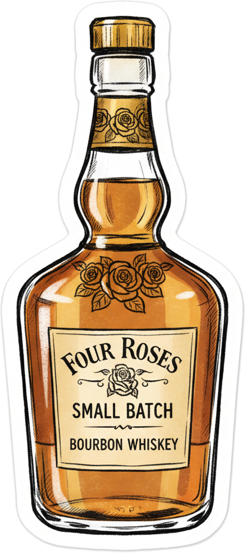
  
  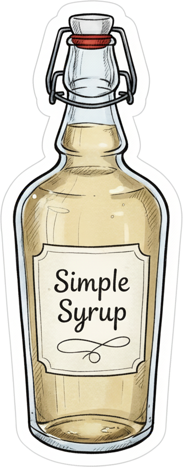
  
  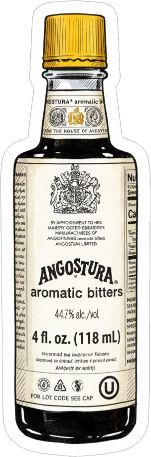
  
  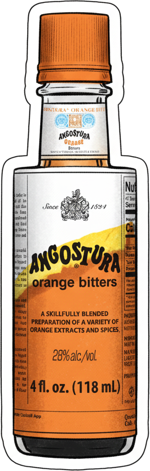
  
  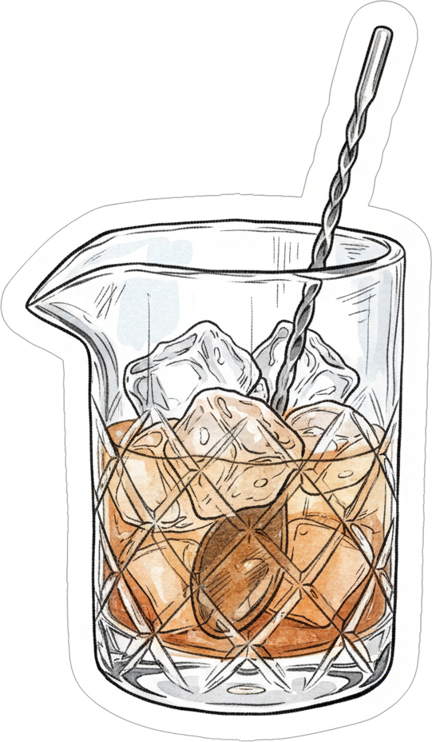
  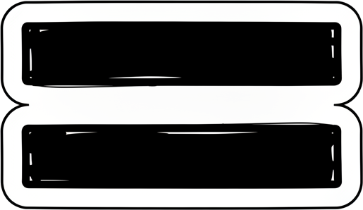
  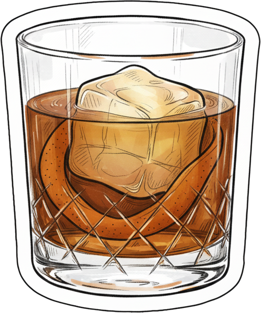
</figure>

Ingredients
: - 2oz whiskey
  - 1/8oz&ndash;1/4oz simple syrup
  - 2 dashes Angostura bitters
  - 2 dashes orange bitters

Method
: Stir in mixing glass with cubed ice. Strain. Pour over ice.

Serving and Garnish
: Rocks glass, large ice cube, Luxardo cherry, orange peel twist

Good Bottles
: Four Roses, Maker's 46. Diplomatico Reserva

Riffs
: - *Swap spirits*: 2oz aged rum for whiskey
  - *Swap sweetener*: swap demerara / maple / blue agave syrup for simple syrup
  - *Add coffee depth*: 1/2oz coffee liqueur
  - *Exotic bitters*: choose &mdash; 2 dashes Aztec chocolate bitters, 2 dashes black walnut bitters

### Sour

<figure class="content cocktail-spec">
  
  
  
  
  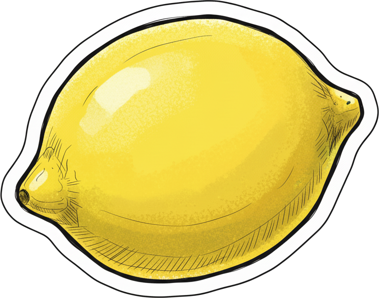
  
  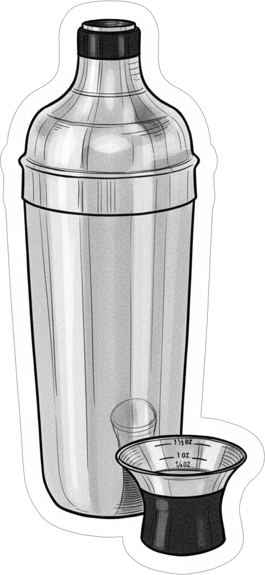
  
  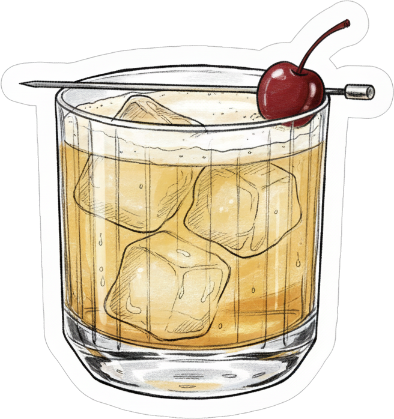
</figure>

Ingredients
: - 2oz whiskey / rum
  - 2&ndash;3oz fresh unpasteurized lemonade[^1]
  - Quarter of a lemon, juiced fresh

Method
: Shake hard with large ice cube (for max foam). Double strain into glass.

Serving and Garnish
: Rocks glass or cocktail glass, up, Luxardo cherry

Good Bottles
: Four Roses

Riffs
: - *Classic*: Use 1oz fresh lemon juice instead of lemonade. Add 1/2oz of simple / maple / demerara syrup.
  - *NY Sour*: Float 0.5oz dry red wine

[^1]: The Trader Joe's refrigerated lemonade works perfectly, no need for additional sweetener

### Manhattan

<figure class="content cocktail-spec">
  
  
  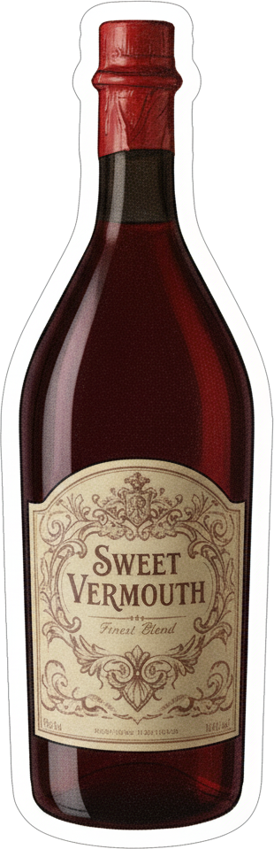
  
  
  
  
  
  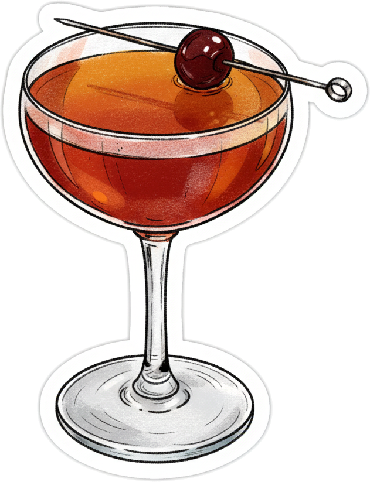
</figure>

Ingredients
: - 2oz whiskey
  - 1oz sweet vermouth (or ruby port)
  - 2 dashes Angostura bitters
  - (Optional) 1 dash black walnut bitters

Method
: Stir in mixing glass with cubed ice. Strain.

Serving and Garnish
: Coupe glass, up, Luxardo cherry

Good Bottles
: Split Carpano Antica + Carpano Punt E Mes + Cocchi Vermouth Di Torino. Otima 10 Year Port. Rittenhouse.

### Highball

<figure class="content cocktail-spec">
  
  
  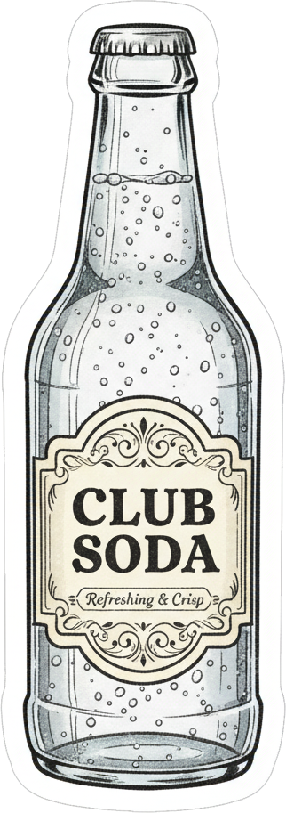
  
  
  
  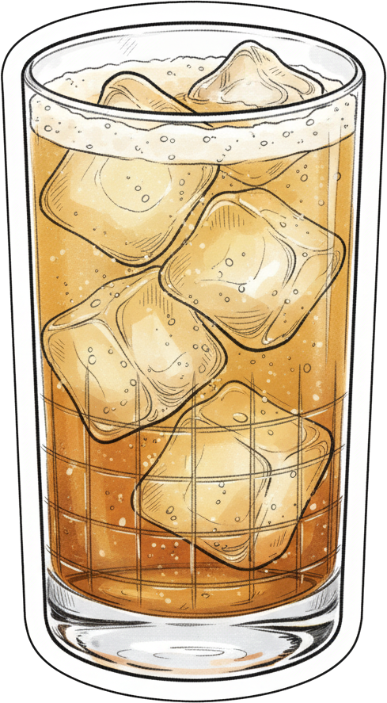
</figure>

Ingredients
: - 2oz whiskey / rum / gin
  - 4&ndash;6oz mixer (club soda, ginger ale, coke, sprite)
  - 1/2oz fresh lime/lemon juice

Method
: Combine in glass with ice. Stir.

Serving and Garnish
: Highball glass, on rocks, Luxardo cherry

Good Bottles
: Suntory Toki

### Daiquiri

<figure class="content cocktail-spec">
  
  
  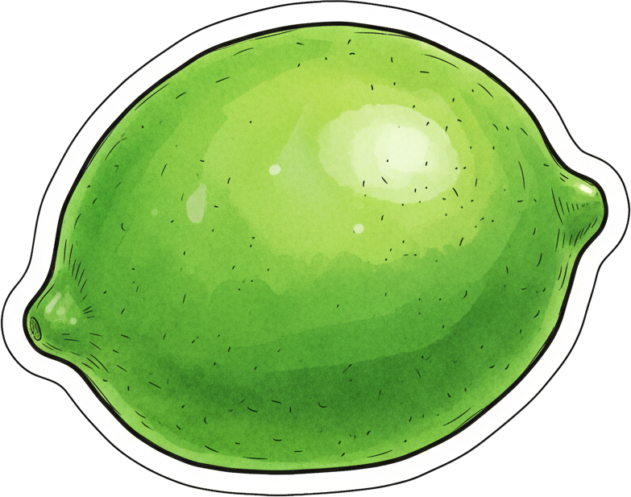
  
  
  
  
  
  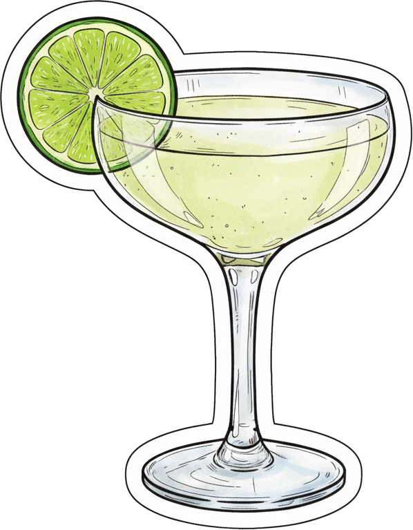
</figure>

Ingredients
: - 2oz white rum
  - 3/4oz&ndash;1oz lime juice (1 lime ≈ 1oz)
  - 1/2oz&ndash;3/4oz simple syrup
  - (Optional) dash of absinthe

Method
: Shake hard with ice. Double strain into glass.

Serving and Garnish
: Cocktail glass, up

Good Bottles
: El Dorado 3, Probitas, Planteray 3 Stars, Flor de Cana 4

### El Presidente

Ingredients
: - 1 1/2oz light rum
  - 3/4oz blanc or dry vermouth
  - 1/4oz orange liqueur
  - 1 barspoon real grenadine

Method
: Stir in mixing glass with ice. Strain.

Serving and Garnish
: Cocktail glass, up

Good Bottles
: Diplomatico Planas, Probitas, El Dorado 3, Plantaray 3 Stars. Lillet Blanc, Dolin Vermouth Blanc.

### Mai Tai

Ingredients
: - 2oz rum
  - 1oz lime juice
  - 1/2oz dry curacao
  - 1/2oz orgeat
  - 1/8&ndash;1/4oz simple / demerara syrup

Method
: Shake with ice. Double strain.

Serving and Garnish
: Large rocks glass, ice pebbles, lime peel

Good Bottles
: Appleton Estate 8 / 12 / 15, El Dorado 8, Smith and Cross. Pierre Ferrand Dry Curacao.

### Gimlet

Ingredients
: - 2oz gin
  - 1/2&ndash;3/4oz lime juice
  - 1/2&ndash;3/4oz simple syrup

Method
: Shake with ice. Double strain.

Serving and Garnish
: Nick and nora or coupe, up, lime wheel garnish

Good Bottles
: Citadelle, Hendrick's, Tanqueray No. Ten, Tanqueray Rangpur, Bluecoat, Monkey 47, Junipero, Barr Hill, Isle of Harris, Roku Gin (Japanese), Gin Mare (Spanish, exotic, olives), Empress 1908 Indigo

### Negroni

Ingredients
: - 1oz gin
  - 1oz sweet vermouth
  - 1oz Campari

Method
: Stir in mixing tin with ice. Strain.

Serving and Garnish
: Rocks glass, one large ice cube, orange peel garnish

Good Bottles
: Cocchi Vermouth di Torino, Cinzano Rosso Vermouth, Carpano Antica Formula, Dolin Rouge Sweet. Tanqueray No. 10.

### Martini

Ingredients
: - 2oz gin
  - 1/2&ndash;3/4oz dry vermouth
  - 1 dash orange bitters
  - (Optional) 1/2&ndash;3/4oz sweet vermouth (for a 'perfect martini')

Method
: Stir in mixing tin with ice. Strain. (Optionally shake)

Serving and Garnish
: Martini glass, up, lemon peel / green olive garnish

Good Bottles
: Plymouth, Bluecoat. Dolin Dry, Noilly Prat Extra Dry.

### Lemon Drop

Ingredients
: - 1 1/2oz gin
  - 3/4oz lemon juice
  - 1/2oz triple sec (sub 1oz limoncello + 1/4oz triple sec)
  - 1/4&ndash;1/2oz simple syrup
  - (Optional) pinch of salt
  - (Optional) one dash orange bitters

Method
: Shake with ice. Double strain.

Serving and Garnish
: Coupe glass, up. Lemon twist or lemon wheel for garnish.

Good Bottles
: Plymouth, Tanqueray No. 10.

### Boulevardier

Ingredients
: - 1 1/2oz bourbon
  - 1oz Campari
  - 1oz sweet vermouth
  - (Optional) small pinch of salt

Method
: Stir in mixing tin with ice. Strain.

Serving and Garnish
: Rocks glass or coupe, one large ice cube, orange peel garnish

Good Bottles
: Same Vermouths as above. Buffalo Trace, Elijah Craig Small Batch.

### Sidecar

Ingredients
: - 2oz cognac / brandy
  - 1/2&ndash;3/4oz Cointreau / Grand Mariner
  - 3/4oz lemon juice
  - 1/4&ndash;1/2oz simple syrup

Method:
: Shake with ice. Double strain.

Serving and Garnish
: Coupe, up, orange and lemon peel garnish

Good Bottles
: Pierre Ferrand Ambre, Pierre Ferrand 1840 Original Formula, Hennessy VS, Remy Martin VSOP

### Between the Sheets

Ingredients
: - 1oz cognac
  - 1oz light rum
  - 1oz triple sec (Cointreau)
  - 1/4oz lemon juice
  - (Optional) pinch of salt
  - (Optional) 1/4oz simple syrup

Method
: Shake with ice. Double strain.

Serving and Garnish
: Cocktail glass, up, express orange peel (no garnish)

Good Bottles
: Same cognacs as above. Plantaray 3 Stars, Flor De Cana 4, El Dorado 3, Diplomatico Planas.

### Port of Call

Ingredients
: - 1oz gin
  - 1oz ruby port wine
  - 3/4oz lemon juice
  - 1/2oz cinnamon syrup
  - 1 tsp cranberry preserves
  - (Optional) sub cinnamon syrup / cranberry for: simple / demerara syrup + Angostura bitters + dash of grenadine / raspberry jam

Method
: Shake with ice. Double strain.

Serving and Garnish
: Rocks glass, crushed ice, mint garnish

Good Bottles
: I have no idea

### Mudslide

Ingredients
: - 1oz Irish cream
  - 1oz coffee liqueur
  - 1oz vanilla vodka
  - 1 1/2oz heavy cream

Method
: Shake with ice. Double strain.

Serving and Garnish
: Rocks glass or coupe, fresh ice OR up, chocolate syrup. Garnish with shaved chocolate.

Good Bottles
: Baileys, Kahlua

### Japanese Snow Monkey

I had [this cocktail](https://www.instagram.com/p/C1IcTPbRGz3/?hl=en) at Rumba.
The spec is given as: "Kiyomi rum, Nigori sake, Bermutto dry vermouth, Campari, raspberry, and lemon".
"A floral but punchy take on a Negroni to help brighten long winter days."
There was a particular roasted corn-like and slightly smoky flavor that was hard to pin down, but was very good.
My attempted reproduction:

Ingredients
: - 1oz Japanese rum (or 3/4oz white rum + 1/4oz agricole blanc)
  - 1oz Nigori sake
  - 3/4oz dry vermouth
  - 1/2oz Campari
  - 1/2oz raspberry syrup OR muddled raspberries + 1/4oz simple syrup
  - 1/2oz lemon juice
  - Sprinkle of salt
  - 3-4 drops of mezcal (for slight smoke)

Method
: Muddle raspberries. Shake with ice. Double strain.

Serving and Garnish
: Coupe, up.

Good Bottles
: Probitas (for rum). Tozai Snow Maiden, Sho Chiku Bai Nigori (for sake).

## Poison Reviews

Here are things I've tried and what I think.
*To be clear*: I have no actual taste in alcohol.
Total amateur opinions to follow.

### Whiskey

- *Maker's Mark 46*. (6/10). I like it. Good enough neat.
- *Woodford Reserve (Regular)*. (4/10). Pretty good, but I prefer Maker's 46 over this. Not so great anymore after having better whiskeys.
- *Suntory Toki*. (6/10). I really like it when mixed. Ideal for highballs and sours. Not great neat.
- *Four Roses Small Batch*. (8/10). The best so far. Excellent. Very smooth and flavorful. Very enjoyable neat. Spending more on bourbon (at least $40 for a 750ml bottle) seems to be worth it.
- *Redbreast 12*. TBD.
- *Michter's US1*. TBD.

### Rum

- *Diplomatico Reserva Exclusiva*. (7/10). I like it. A few feel it is too harsh and doesn't go down smooth, at least neat. But I'm a fan.
- *Appleton Estate 8*. TBD.

### Soju

- *Hwayo 25 Soju*. (5/10). Has an initial taste much closer to sake than soju, but still inferior to sake. Good to try, but the aftertaste is still too alcoholic.
- *Ilpoom Jinro Oak 43 Soju*. TBD.

### Gin

- *Citadelle Gin*. (9/10). Excellent 'celery'-like + juniper berry flavor, freshness as the final note. Gimlet with this is too good.
- *Hendrick's Gin.* (8/10). Also very good, but more subtle finish and harsher down the throat vs Citadelle

### Wines

- Port
  - *Porto Morgado Old Tawny (10 Years)*. (7/10). Sits around $10 from Trader Joe's. Hits way way above its price point. We love this.
  - *Porto Morgado Ruby*. (5/10). Not as good. Similar price point, but much worse than above imo.
  - *Fairbanks Cellars California Port (1.5L)*. (2/10). Cheap but bad. Stay away.
  - *Warre's Otima 10 Tawny Porto*. TBD.
- Reds
  - *Decoy Cabernet*. (5/10). Decent, hits a bit above its price point, but it's better to spend more.
  - *Sean Thackrey Pleiades XXXII*. (9/10) Very good. Fruity and smooth.
  - *Charles Shaw wines (all varieties)*. (3/10). Very cheap, but do not buy lol. Get something nicer.
  - *No Es Pituko Carignan 2024*. (8/10). So so smooth, hard to believe there was any alcohol at all. Excellent.
  - *Chateau Pey-Bonhomme Le-Tours Merlot*. TBD.
  - *Folk Machine Pinot Noir*. TBD.
  - *Love Red 2022 - Broc Cellars*. TBD.
- Whites
  - *2021 Virgo Magic Wines 'Disco Lemonade' Riesling*. (5/10). Tastes heavily like brined olives. I think this is an acquired taste, not for a general audience.
  - *Barefoot Moscato*. (2/10). Cheap, mild tasting, and gulpable. Get something nicer.
  - *Risata Moscato d'Asti DOCG*. (8/10). Low alcohol, smooth, sweet, and fruity. A crowd favorite.
  - *2023 Nickel & Nickel Grand Sky Vineyard Chardonnay*. (9/10) Incredibly good, smooth, bright lime aftertaste.
- Orange
  - *2023 Suisun Valley Assyrtiko, Hydrangea Skin-Contact*. (8/10). Excellent.
  - *Pielihueso Naranjo 2024*. (9/10). Very very good. Smooth, slightly fruity, and crisp. Best served cold.
  - *2023 Gulp Hablo Orange (1L)*. TBD.

### Meads

- The [Remeadies](https://www.remeadies.com/) meadery near Sequoia National Park is very good. Go there if nearby. Unfortunately, their meads aren't easily available in NorCal.
- *Chaucer's Mead*. (6/10). Very vanilla alcoholic honey flavor, smooth. Nothing objectionable, but nothing special either. Good for the price.
- *Sky River Sweet Mead*. (7/10). At $30 it is expensive for what it is. Much more complex mead with a barnyard / wet grass flavor and floral notes. Not appreciated by everyone.

### Sake

[Takara Sake](https://www.takarasake.com) has a sake factory in Berkeley, CA!
I highly recommend visiting them and doing a tasting.
What follows are all sakes from Takara (some brewed in Berkeley, others in Japan).

- *Sho Chiku Bai REI Junmai Daiginjo*. (8/10). One of our favorites. Cheap and good, serve chilled, crisp, fruity, and smooth. If it is too old, it will acquire a mushroom-y flavor.
- *Sho Chiku Bai Organic Nama*. (6/10). Good chilled, but has an earthy flavor. Not suitable for a general audience.
- *Sho Chiku Bai Takara Sierra Cold*. (7/10). This is an insane sake. Serve chilled. 12% ABV but tastes like zero! Very light flavor of slight sweetness and fruit, but mostly tasteless.
- *Sho Chiku Bai Nigori Crème de Sake*. (9/10). Cream sake! One of our favorites. Serve chilled. Flavor is both fruity and earthy, more on the sweet side.

### Cocktail Liquors

- *Dolin Rouge (Sweet) Vermouth*. Decent, I have no comparison point.
- *Cointreau*. It works, I have no reference point for orange liqueur.
- *Baileys*. Sweet, smooth, milky. Nothing bad, but nothing great either.
- *Mr. Black Cold Brew Coffee Liqueur*. Decent, good espresso flavor.
- *TJ's Limoncello*. TBD.

### Garnishes

- *Luxadro cherries*. TBD. These are so expensive, it better be worth it.
  - Totally worth it. So delicious and the syrup is great to add to a cocktail.
- *Angostura bitters*. It is what it is, pretty good &mdash; not many other options.

## Equipment

First, there is some basic equipment that you need, that I wish I had from the start.
Just buy these things.

- *Large ice cube tray*: I liked these Tovolo "King Cube" silicon trays ([Amazon link](https://www.amazon.com/dp/B01LXF6H2Y))
- *Regular ice cube tray*: I bought some "no-spill" trays from OXO ([Amazon link](https://www.amazon.com/dp/B007U256D2?ref=ppx_yo2ov_dt_b_fed_asin_title&th=1))
- *Jigger*: There are 2 major varieties (double-ended and angled). You need to be able to measure volumes from 1/4oz to 2oz. I think the angled jiggers are way easier to use at home with less spillage than the double-ended kind. I like this one from OXO ([Amazon link](https://www.amazon.com/dp/B00B6LUAPW)).
- *Rocks Glasses*: Of course you need glasses to serve cocktails in. Of all the varieties, I find [rocks glasses](en.wikipedia.org/wiki/Old_fashioned_glass) to be the most versatile, albeit not the prettiest. I bought these ones from Anchor Hocking ([Amazon link](https://www.amazon.com/dp/B00BC3MI5O)). [Coupes](https://en.wikipedia.org/wiki/Champagne_glass#Coupe) or [nick and noras](https://en.wikipedia.org/wiki/Nick_%26_Nora_(glass)) would be good next additions.
- *Citrus juicer*: These are cheap, just get any one. I want to try the Barfly Large Manual Juicer sometime ([Amazon link](https://www.amazon.com/Barfly-Large-Manual-Juicer-Aluminum/dp/B0B14PYCRF))
- *Mixing tin*: There are also cocktail mixing glasses, but I prefer a stainless steel mixing vessel. I have this one from American Metalcraft ([Amazon link](https://www.amazon.com/dp/B09QQQGTWY)).
- *Hawthorne Strainer*: This OXO one is good ([Amazon link](https://www.amazon.com/dp/B0000DAQ93))
- *Cobbler shaker*: There are also Boston shakers, but a cobbler shaker is far easier to use at home. I got this one from OXO ([Amazon link](https://www.amazon.com/dp/B07JW89TC3)). If I was OK spending $60 on this, I would buy the [YETI one](https://www.yeti.com/drinkware/barware/cocktail-shaker-20oz.html).
- *Fine mesh strainer*: I have a 3" strainer from OXO ([Amazon link](https://www.amazon.com/OXO-Grips-3-Inch-Strainer-Multicolor/dp/B001713L84))
- *Bar spoon*: Just get some cheap bar spoons, the exact model doesn't matter.
- *Corkscrew*: You need to be able to pull corks. Buy whatever is within your budget - these are all kind of the same.
- *Toothpicks*: The poor man's version of the fancy cocktail pick. Often too short to place over the rim of a glass
  - *Cocktail picks*: A substantial upgrade
- *Cooler*: I use an insulated bag to hold all my ice and cold liquors, but a proper hard-case insulated cooler would be better.

Now, there is nothing to do except chill all your mixers and liquors.
Since all the cocktails I like are served chilled, I even chill the liquors that aren't typically chilled (whiskey, vermouth, rum, soju).

## My Shelf

- Wine
  - Otima 10-Year Tawny Port
  - Chateau Pey-Bonhomme Le-Tours
  - Folk Machine Pinot Noir
  - Love Red 2022 - Broc Cellars
- Whiskey
  - Four Roses Small Batch
  - Mitcher's US*1
  - Redbreast 12 Year
- Rum
  - Diplomatico Reserva Exclusiva
  - Appleton Estate 8
- Sake
  - Hakutsuru Sayuri Nigori Sake
- Soju
  - Oak 43
- Gin
  - Hendricks
- Liquors
  - Campari
  - Sole Vermouth (Extra Dry)
  - Dolin Vermouth Rouge (Sweet)
  - TJ's Sicilian Limoncello (x2)
  - Vanilla vodka
  - Cointreau
  - Mr. Black Cold Brew Coffee Liqueur
  - Baileys Original Irish Cream
- Extras
  - _Bitters_: Angostura, Orange
  - _Syrups_: Simple, Demerara, Grenadine, Orgeat
  - Luxardo cherries
  - Limes / lemons
  - Heavy cream
  - Chocolate syrup

## To Buy

Bottles I have either bought or want to try.

### Whiskey

- Four Roses Small Batch
- Four Roses Single Barrel
- Michter's US1 Bourbon
- Redbreast 12 Yr Irish Whiskey
- Larceny Small Batch
- Angel's Envy
- Rittenhouse 100
- Nikka Whisky From The Barrel

### Rum

- White Rum
  - Probitas
  - El Dorado 3
  - Flor de Cana 4
  - Diplomatico Planas
- Aged Rum
  - Appleton Estate 8 / 12
  - El Dorado 8 / 12
  - Santa Teresa 1796
  - Diplomático Mantuano
  - El Pasador de Oro Rum XO
  - Kaniche XO Artisanal Rum

### Gin

- Citadelle Gin
- Citadelle Jardin D'Ete Gin

### Cognac

- ABK6 VSOP Cognac
- Hennessy VSOP
- Pierre Ferrand Ambre / Original Formula

### Liquors

- Orange liquors
  - "Traditional" curacao, rum-based: Pierre Ferrand Dry Curacao, Santa Teresa Rhum Orange
  - Brandy-based curacao: Grand Mariner
  - Triple secs: Cointreau
