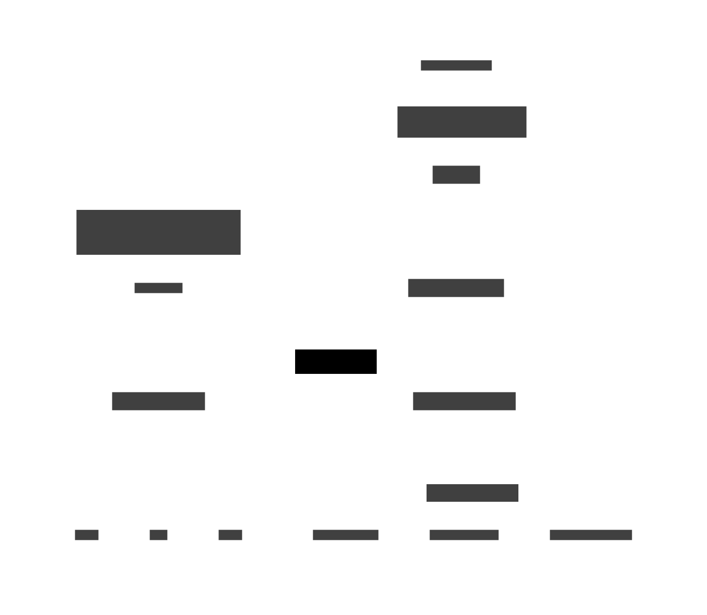

+++
title = "The RISC-V Boot and Bringup Flow (Berkeley Edition)"
date = 2025-02-05
description = "HTIF, Fesvr, TSI, PLIC, CLINT, spike, what is all of this stuff?"
+++

Let's understand how a RISC-V binary boots and runs on a RISC-V core modeled in spike or in RTL simulation.
We will begin with a very simple baremetal program and understand the program loading mechanics, the bootrom and initialization sequence, and how the RISC-V core communicates with a tethered host.

This article assumes basic knowledge about using the command line / shell, Linux, the RISC-V ISA, and CPU architecture.
If you don't possess these prerequisites, you must carefully go through [MIT's "missing semester" course](https://missing.csail.mit.edu/) before reading on.

## Dependencies

Before we get started, let's install some required dependencies on your laptop.

### Host Toolchain and Libraries

Install a basic development environment (`gcc`, `make`, etc.) on your host system:

- **Arch Linux**: `pacman -S base-devel`
- **Ubuntu**: `apt install build-essential`
- **OSX**: `brew install gcc make cmake automake autoconf libtool` + `xcode-select --install`
- **Windows**: Use WSL

You also need a few other dependencies for `spike`:

- **Arch Linux**: `pacman -S dtc boost-libs`
- **Ubuntu**: `apt-get install device-tree-compiler libboost-regex-dev libboost-system-dev`
- **OSX**: `brew install dtc boost`

### RISC-V Cross Compiler

You need a GCC *cross-compiler* that runs on your host architecture (x86 or ARM) and compiles source code (e.g. C, assembly) into a RISC-V binary.

- **Linux**: Look at the releases page for [riscv-gnu-toolchain](https://github.com/riscv-collab/riscv-gnu-toolchain/tags). Download the file that looks like `riscv64-elf-ubuntu-24.04-gcc-nightly-...tar.xz` (the key words are: `riscv64`, `elf`, `gcc`). Uncompress the `.tar.xz` file and add the `bin` folder inside to your `$PATH`.
- **OSX**: Follow the instructions in the `README` in [homebrew-riscv](https://github.com/riscv-software-src/homebrew-riscv). Alternatively, you can install the [`riscv64-elf-gcc` Homebrew package](https://formulae.brew.sh/formula/riscv64-elf-gcc), but truthfully I don't know if this package contains everything you need.

After you install the cross compiler, verify it exists and runs.

```bash
which riscv64-unknown-elf-gcc
riscv64-unknown-elf-gcc -v
```

### spike: The RISC-V Instruction Set Simulator

`spike` is the golden RISC-V instruction set simulator (ISS).
You give it a RISC-V binary and `spike` will interpret it one instruction at a time.
`spike` models all the architectural state of a RISC-V hart (hardware thread), backing memory (DRAM), and several other devices in a RISC-V SoC (CLINT, PLIC, UART) we will learn about soon.

You need to set the `$RISCV` environment variable to some folder where `spike` will be installed to.
Typically, it is set to the folder where you decompressed the riscv-gcc toolchain.
You can also just create a folder anywhere on your disk.

```bash
export RISCV=/path/to/some/sysroot
export PATH="$PATH:$RISCV/bin"
```

Time to build `spike` from source.

```bash
git clone git@github.com:riscv-software-src/riscv-isa-sim && cd riscv-isa-sim
mkdir build
cd build
../configure --prefix=$RISCV
make -j8
make install
```

Verify everything is OK:

```bash
which spike
spike --dump-dts TEST
```

## First Steps

### A Simple Assembly Program

Let's start with the simplest program we could write.
It just loads 2 registers with literals, adds them together, and does this in a loop.

```asm
// simple.S
.section .text
.global _start
_start:
    li a0, 1
    li a1, 2
    add a2, a0, a1
    j _start
```

**Find out for yourself**: what do `.section .text` and `.global _start` mean?
Let's compile this program and run it with spike.

```bash
riscv64-unknown-elf-gcc -nostartfiles -ffreestanding -march=rv64gc -mabi=lp64 -o simple.elf simple.S
```

**Find out for yourself**: what do the command line options passed to `gcc` mean?
Now let's run the generated `elf` file with spike.

```bash
spike simple.elf
Access exception occurred while loading payload simple.elf:
Memory address 0x100b8 is invalid
```

Oh no, something is wrong. Spike is unhappy with the ELF we gave it.
To investigate further, let's disassemble the ELF binary.

```bash
riscv64-unknown-elf-objdump -D simple.elf
```

```text
simple.elf:     file format elf64-littleriscv

Disassembly of section .text:

00000000000100b0 <_start>:
   100b0:	4505                  li  a0,1
   100b2:	4589                  li  a1,2
   100b4:	00b50633              add a2,a0,a1
   100b8:	bfe5                  j   100b0 <_start>
```

Indeed, we can see that the binary starts at the address `0x100b0`, but it seems spike doesn't like that.
If you do some more investigation, you'll find that gcc has a default linker script for RISC-V which sets the starting address for the ELF to `0x10000`, which is followed by the ELF headers, and then the program itself at `0x100b0`.

### The SoC Memory Map and Linker Scripts

It seems spike doesn't like that this binary begins at the memory address `0x100b0`.
So, what address should this binary be loaded at?

When a RISC-V hart executes a load or store instruction, or fetches from the current PC, it sends an addressed request into the memory system.
The request's address determines which device in the SoC the request will be routed to.
This map from address to device is referred to as the *SoC memory map*.

So, what is the memory map of the SoC that spike is modeling?
We can run `spike --dump-dts DUMP` to find out (this dumps the *device tree* of the modeled SoC).
**Find out for yourself**: what is a device tree?

```text
  memory@80000000 {
    device_type = "memory";
    reg = <0x0 0x80000000 0x0 0x80000000>;
  };
```

These lines indicate that memory (DRAM) begins at address `0x8000_0000` and is `0x8000_0000` bytes (2 GiB).
So the address `0x100b0` isn't mapped to DRAM. It isn't mapped to anything!
This explains why spike raised an error saying the ELF base memory address is invalid.

How do we fix this?
We want the linker to place the program's instructions at the beginning of the DRAM address space.
Let's write a custom linker script that instructs gcc to place the program at `0x8000_0000`.

```linker
# link.ld
OUTPUT_ARCH(riscv)
ENTRY(_start)

SECTIONS {
    . = 0x80000000; /* Typical start address for RISC-V */
    .text : {
        *(.text)
    }
    .data : {
        *(.data)
    }
    .bss : {
        *(.bss)
    }
}
```

**Find out for yourself**: what does this linker script do? What data do the various sections (`.text`, `.data`, `.bss`) hold?
Now, use this linker script with `gcc`.

```bash
riscv64-unknown-elf-gcc -nostartfiles -ffreestanding -march=rv64gc -mabi=lp64 -o simple.elf -T link.ld simple.S
```

**Find out for yourself**: disassemble this binary and observe the impact that using this linker script had.
Let's run this binary on spike.
We know this binary has an infinite loop, so we should only run a handful of instructions to observe what is happening.
To do this, we will use spike's debug (`-d`) mode (run `help` for a full list of commands in debug mode) and dump spike's instruction commit log to a file (`spike.log`).

```bash
spike -d --log=spike.log simple.elf
warning: tohost and fromhost symbols not in ELF; can't communicate with target
(spike) run 100
(spike) quit
```

Let's look at the log that spike wrote.

```text
core   0: 0x0000000000001000 (0x00000297) auipc   t0, 0x0
core   0: 0x0000000000001004 (0x02028593) addi    a1, t0, 32
core   0: 0x0000000000001008 (0xf1402573) csrr    a0, mhartid
core   0: 0x000000000000100c (0x0182b283) ld      t0, 24(t0)
core   0: 0x0000000000001010 (0x00028067) jr      t0
core   0: >>>>  $xrv64i2p1_m2p0_a2p1_f2p2_d2p2_c2p0_zicsr2p0_zifencei2p0_zmmul1p0_zaamo1p0_zalrsc1p0
core   0: 0x0000000080000000 (0x00004505) c.li    a0, 1
core   0: 0x0000000080000002 (0x00004589) c.li    a1, 2
core   0: 0x0000000080000004 (0x00b50633) add     a2, a0, a1
core   0: 0x0000000080000008 (0x0000bfe5) c.j     pc - 8
core   0: >>>>  $xrv64i2p1_m2p0_a2p1_f2p2_d2p2_c2p0_zicsr2p0_zifencei2p0_zmmul1p0_zaamo1p0_zalrsc1p0
core   0: 0x0000000080000000 (0x00004505) c.li    a0, 1
core   0: 0x0000000080000002 (0x00004589) c.li    a1, 2
core   0: 0x0000000080000004 (0x00b50633) add     a2, a0, a1
core   0: 0x0000000080000008 (0x0000bfe5) c.j     pc - 8
```

The format of this log is `core <core number>: <PC> (<raw instruction bytes>) <disassembled instruction>`.
We can see the code we wrote and observe the infinite loop.
But there is some code that spike seems to run even before it reaches our program at (`0x8000_0000`)!

### The Bootrom

Notice that the first instruction spike fetches is at address `0x1000`.
But we don't see that address in the spike DTS.

What's happening is that spike models a hart that begins executing instructions from a hardcoded address (in this case `0x1000`) upon coming out of reset.
The hardcoded set of instructions that a hart executes at boot is called the *reset vector*, and it is stored in the *bootrom*.

The reset vector and bootrom are defined in [`riscv/sim.cc` in spike](https://github.com/riscv-software-src/riscv-isa-sim/blob/master/riscv/sim.cc#L361).

```cpp
  reg_t start_pc = cfg->start_pc.value_or(get_entry_point());

  uint32_t reset_vec[reset_vec_size] = {
    0x297,                                      // auipc  t0,0x0
    0x28593 + (reset_vec_size * 4 << 20),       // addi   a1, t0, &dtb
    0xf1402573,                                 // csrr   a0, mhartid
    get_core(0)->get_xlen() == 32 ?
      0x0182a283u :                             // lw     t0,24(t0)
      0x0182b283u,                              // ld     t0,24(t0)
    0x28067,                                    // jr     t0
    0,
    (uint32_t) (start_pc & 0xffffffff),
    (uint32_t) (start_pc >> 32)
  };
  // ...
  std::vector<char> rom((char*)reset_vec, (char*)reset_vec + sizeof(reset_vec));
  rom.insert(rom.end(), dtb.begin(), dtb.end());
```

The bootrom consists of the instructions we just saw + the `start_pc` + the DTB (the binary form of the device tree).
Let's break down what these instructions do.

1. `auipc t0, 0x0`: The current PC (`0x1000`) is loaded into `t0`
2. `addi a1, t0, 32`: The base address of the DTS is stored in `a1`
3. `csrr a0, mhartid`: Load the current hart's ID into `a0` (every hart in a RISC-V SoC has a unique id, starting at 0)
4. `ld t0, 24(t0)`: Load the `start_pc` into `t0` (the `start_pc` is located 24 bytes from the start of the reset vector)
5. `jr t0`: Jump to the `start_pc`

When the program we pass to spike begins to run, it can immediately reference the hart ID and the base of the DTS.
But wait, where does this `start_pc` come from?

Looking at the code, it comes from calling `get_entry_point()`, which is [defined in `fesvr/htif.h`](https://github.com/riscv-software-src/riscv-isa-sim/blob/master/fesvr/htif.h#L70).
We will get back to that soon, but essentially it reads the ELF file and queries where program execution should begin.
**Try this yourself**: `riscv64-unknown-elf-readelf -a simple.elf`.

### How Can The Program Exit?

OK, so far, so good.
The program runs on spike and we know how spike's bootup routine works.

But, the program runs in an infinite loop!
If we left off the final jump instruction, the program still wouldn't exit.
**Try this yourself**. **What happens**?

To be able to exit the program, we must first understand *host-tethering*.

## HTIF (Berkeley Host-Target Interface)

<!--
1. Start with the simplest possible asm program, introduce host htif communication to exit the program
  - Will have to discuss linker scripts, memory layout, assembler, spike, and htif
-->

Now is a good time to understand the target and host components of spike.
We refer to the SoC that is being emulated (consisting of a RISC-V core connected to DRAM and peripherals) as the **target**.
The **host** refers to the components of spike that *interact with the target* (e.g. load ELF binaries) and provide services (e.g. exiting / printing to the console).

### Fesvr Architecture



This is a logical overview of spike's architecture.
The code for spike doesn't exactly correspond to these boxes, but the diagram is mostly accurate.
Let's walk through how spike begins to execute a program on a modeled RISC-V target.

1. The RISC-V ELF binary is passed to [`fesvr` (the "front-end server")](https://github.com/riscv-software-src/riscv-isa-sim/tree/master/fesvr) which contains the [`elfloader` component](https://github.com/riscv-software-src/riscv-isa-sim/blob/master/fesvr/elfloader.cc) that parses the ELF, analyzes its sections, and loads them into the target's DRAM.
2. The `elfloader` interacts with the target using the [HTIF (host-target interface)](https://github.com/riscv-software-src/riscv-isa-sim/blob/master/fesvr/htif.h)
  - The 2 primary functions that define the HTIF interface are `read_chunk()` and `write_chunk()`, [defined in `htif.h`](https://github.com/riscv-software-src/riscv-isa-sim/blob/master/fesvr/htif.h#L58)
  - These functions allow the *host to access the target's memory space*. Calls to `write_chunk()` by the `elfloader` are used to write the ELF binary into the target's DRAM.
  - HTIF refers to the *interface* and a *protocol* for proxying target syscalls, while `fesvr` contains the host components that interact with the target *using HTIF*
  - HTIF is **not** a RISC-V standard. It is a Berkeley-specific hack from more than a decade ago that has proliferated more than we would have liked
3. Once the ELF is loaded into the target's DRAM, the HTIF protocol constantly reads from the `tohost` address on the target
  - `tohost` is a target memory address defined in the ELF
  - The program running on the target writes to the `tohost` address to communicate with the host
  - This allows the target to exit or print to the console (i.e. access host services)

### HTIF Syscall Proxy Architecture


This figure provides an overview of how HTIF performs syscall proxying.
HTIF periodically polls the value of `tohost` and if its non-zero, delegates to its device list.
The device ID encoded in the `tohost` value is used to select a device to handle the target's request.
The command ID also encoded in `tohost`

#### Read the Code

Now we will walk through the code in fesvr to understand the HTIF protocol in depth.
You can skip this part.

### Exiting via HTIF

> * How the program prints stuff & executes sys-calls in bare metal mode
> * There are `toHost` and `fromHost` addresses in the `elf` file
> * While the binary is executing in the SoC and meets a `printf` function…
>   1. It writes the address of the string to the `toHost` address
>   2. Fesvr periodically checks `toHost` address
>   3. When the value of `toHost` is not zero, it executes some action according to the value
>      * E.g., `abort` `tohost_exit` `handle_trap` `print_str` all have different addresses

### Printing Strings via HTIF

## Baremetal C

<!--
1. Then use C (need to discuss crt.S, how to compile baremetal, buliding a htif library for launching syscalls)
  - Then show the htif library that exists already within spike
1. libgloss, what is it? how does it let us use regular libc functions, but delegate the syscall interface as we would like
-->

### crt.S

### libgloss

## Booting a Rocket Core in RTL Simulation

Now going into RTL simulation world

### Loading the Program Into Memory

- From the RocketTile alone, reset vector, baremetal programs, the role of crt0.S, how the linker script works, physical memory

#### TSI

#### Fast DRAM Loading

### Chipyard SoC Bootrom

#### CLINT

software interrupt trigger to jump to start PC

> 1. The core wakes out of reset
> 2. The core fetches instructions from the BootROM (the address of the BootROM 0x10000, is a hardcoded value inside the core)
> 3. The core spins using the instructions from the BootROM (boot sequence)
> 4. Meanwhile, fesvr writes to binary to DRAM (this is not-coherent)
> 5. When the fesvr is done writing the binary to the DRAM, it sends a TSI msg which gets translated to a TL msg which is sent to the CLINT which raises the MSIP(machine software) interrupt which pulls the core out of the boot sequence, and makes it jump to the starting point of the binary

### CSRs

- Even more: how do syscalls work, how does proxying work, how can we use CSRs for measuring time and performance

## Running Userspace Binaries with pk

<!--
1. How does pk work?
1. Virtual memory (setup routines and CSR configuration and page tables)
- Virtual memory: how does the virtual memory environment work for the ISA tests, how does pk work?
-->

### Virtual Memory

## Booting Linux

<!--
1. OpenSBI + Linux boot? Final thing to show is how Linux sets up kernel mode logic and hands off things to userspace
- FSBL: how does opensbi work? understanding privilege modes
-->

## RISC-V Baremetal Rust


## Multicore

<!--
1. Multicore programs, how do the riscv-benchmarks work in multicore mode?
-->

## Resources

### Baremetal Rust for RISC-V

- https://github.com/defermelowie/bare-metal-rust-on-riscv (Rust mode!)
  - embedded rust book: https://docs.rust-embedded.org/book/start/semihosting.html
  - rust based tsi implementation: https://github.com/ucb-bar/tsi
  - https://docs.rust-embedded.org/embedonomicon/smallest-no-std.html

### TSI

- Standalone TSI: https://github.com/ucb-bar/tsi
- TSI protocol
  - https://github.com/riscv-software-src/riscv-isa-sim/blob/master/fesvr/tsi.cc#L55
  - https://github.com/riscv-software-src/riscv-isa-sim/blob/master/fesvr/tsi.h
- TSI to tilelink:
  - https://github.com/ucb-bar/testchipip/blob/master/src/main/scala/tsi/TSIToTileLink.scala
- Sending TSI transactions over UART:
  - https://github.com/ucb-bar/testchipip/blob/master/src/main/scala/uart/UARTToSerial.scala

### Chipyard

- How does the RTL-side memory map get generated?
  - See the diplomacy API: https://chipyard.readthedocs.io/en/latest/TileLink-Diplomacy-Reference/index.html
  - Diplomacy paper: https://carrv.github.io/2017/papers/cook-diplomacy-carrv2017.pdf
- [6.13. Chipyard Boot Process — Chipyard 1.9.0 documentation](https://chipyard.readthedocs.io/en/stable/Customization/Boot-Process.html#bootrom-and-risc-v-frontend-server)

### RISC-V Toolchain

- [The SiFive "All Aboard" blog post series](https://www.sifive.com/blog/all-aboard-part-0-introduction)

> All Aboard, Part 0: Introduction (current page)
> All Aboard, Part 1: The -march, -mabi, and -mtune arguments to RISC-V Compilers
> All Aboard, Part 2: Relocations in ELF Toolchains
> All Aboard, Part 3: Linker Relaxation in the RISC-V Toolchain
> All Aboard, Part 4: The RISC-V Code Models
> All Aboard, Part 5: Per-march and per-mabi Library Paths on RISC-V Systems
> All Aboard, Part 6: Booting a RISC-V Linux Kernel
> All Aboard, Part 7: Entering and Exiting the Linux Kernel on RISC-V
> All Aboard, Part 8: The RISC-V Linux Port is Upstream!
> All Aboard, Part 9: Paging and the MMU in the RISC-V Linux Kernel
> All Aboard, Part 10: How to Contribute to the RISC-V Software Ecosystem
> All Aboard, Part 11: RISC-V Hackathon, Presented by SiFive

- [Putting the “You” in CPU](https://cpu.land/)

> Multitasking, Exec, ELF, Paging, Fork-Exec

- [Structure of the RISC-V Software Stack (2015)](https://riscv.org/wp-content/uploads/2015/01/riscv-software-stack-bootcamp-jan2015.pdf) ([Archive](https://web.archive.org/web/20240717110728/https://riscv.org/wp-content/uploads/2015/01/riscv-software-stack-bootcamp-jan2015.pdf))
